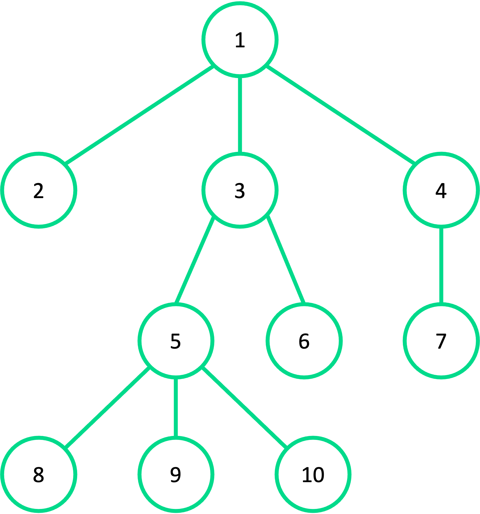
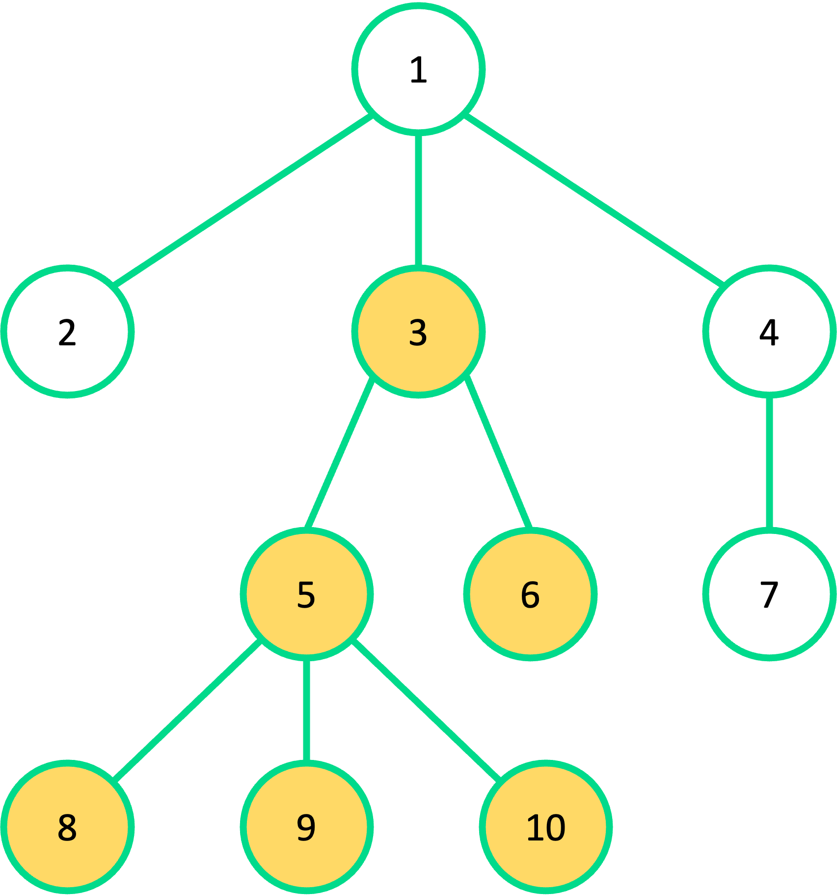
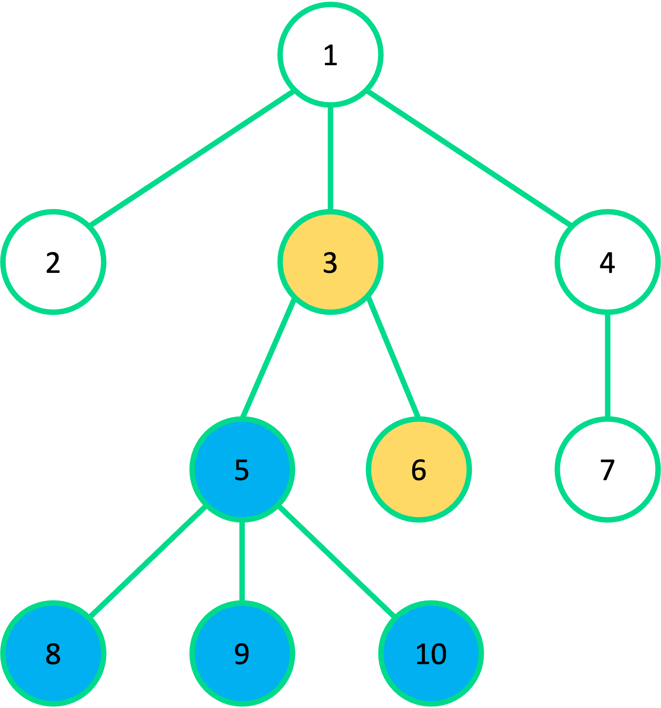

# 트리 색칠하기

### Level: 골드5


| 시간 제한 | 메모리 제한 |
| -------- | ---------- |
| 1 초 | 512 MB |

## 문제 설명

정점이 $N$개인 트리가 있다. 정점에는 1부터 $N$까지 번호가 붙어있다. 트리의 루트는 항상 1번 정점이며 맨 처음에는 모든 정점이 하얀색으로 칠해져 있는 상태이다.

하나의 정점에 색칠하면 해당 정점 아래 있는 모든 정점이 같은 색으로 칠해진다. 색은 섞이지 않고 색칠할 때마다 그 색으로 덮어진다. 단, 하얀색으로 색칠할 수는 없다.

아래 그림처럼 정점 10개로 구성된 트리가 있다고 가정을 해보자.



[그림 1] 하얀색으로 칠해져 있는 트리

3번 정점을 노란색으로 칠하면 그 아래 있는 정점 5, 6, 8, 9, 10 모두 노란색으로 칠해진다.



[그림 2] 정점 3에 노란색을 칠한 후 트리의 상태

그리고 정점 5에 파란색을 칠한다면 그 아래 있는 정점 8, 9, 10 모두 파란색으로 칠해진다.



[그림 3] 정점 5에 파란색을 칠한 후 트리의 상태

입력으로 트리의 정보와 정점의 색 정보가 주어진다. 색 정보는 음이 아닌 정수로 주어지며 값이 0인 경우는 항상 하얀색을 의미한다.

## 입력

첫째 줄에 트리를 구성하는 정점의 개수 $N(1 ≤ N ≤ 200,000)$이 주어진다.

둘째 줄에 1번 정점부터 $N$번 정점까지 각 색 정보 $C_i (0 ≤ C_i ≤ N)$가 공백으로 구분되어 주어진다.

셋째 줄부터 $N - 1$개의 줄에 걸쳐 연결된 두 정점 $a, b(1 ≤ a, b ≤ N$, $a ≠ b)$가 공백으로 구분되어 주어진다.  

모든 정점을 칠할 수 있는 입력만 주어진다.

## 출력

하얀색을 제외한 색만 사용해서 모든 정점을 원하는 색으로 칠하기 위해 최소 몇 번 칠하면 되는지 출력한다.

### 예제 입력1 & 예제 출력1

```text
7
0 0 2 0 1 2 2
1 2
1 3
1 4
2 5
3 6
3 7

```

```text
2

```

### 예제 입력2 & 예제 출력2

```text
10
0 0 1 0 2 1 0 2 2 2
3 1
1 4
9 5
10 5
1 2
3 6
3 5
5 8
4 7

```

```text
2

```

---

ref: https://www.acmicpc.net/problem/24230
