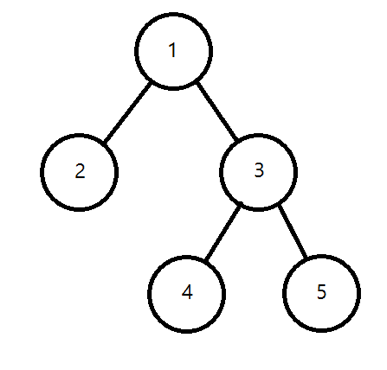

# 나무 위의 구슬

### Level: 골드1


| 시간 제한 | 메모리 제한 |
| -------- | ---------- |
| 1 초 | 128 MB |

## 문제 설명



이진 트리란, 위처럼 모든 노드의 자식의 수가 2개 이하인 트리이다.

각 노드에 쓰여 있는 수는 노드의 번호를 의미한다.

특히, 이 문제에서는 루트가 고정되어 있으며, 노드의 순서가 중요한(어떤 서브트리에서도 좌우를 변경할 수 없는) 이진 트리에 대해 다루기로 한다.

이진 트리의 루트에 구슬을 하나 올려놓으면 구슬은 아래와 같은 과정을 거쳐 떨어진다.

1. 현재 구슬이 놓인 노드의 자식이 없다면 그 자리에서 멈춘다.
2. 1을 만족하지 않으며, 만일 현재 구슬이 놓인 노드의 자식 노드가 한 개라면 해당 자식 노드로 떨어진다.
3. 1, 2를 만족하지 않으며, 만일 현재 구슬이 놓인 노드의 자식 노드가 두 개라면,
    1. 현재 노드의 왼쪽 서브트리에 담긴 모든 구슬의 수 <= 오른쪽 서브트리에 담긴 모든 구슬의 수일 경우, 왼쪽 자식 노드로 떨어진다.
    2. 그 외의 경우에는 오른쪽 자식 노드로 떨어진다.

4. 1~3번의 조건을 다시 체크하고 되풀이한다.

구슬은 위와 같은 과정을 거쳐 결국 단말 노드에 쌓이게 된다.

예를 들어, 위의 그림과 같은 트리에 구슬을 떨어뜨릴 경우,

첫 다섯 개의 구슬은 2번, 4번, 2번, 5번, 2번 노드에 차례대로 떨어지게 된다.

위처럼 트리가 충분히 작거나 구슬의 수가 충분히 적을 경우엔 직접 시뮬레이션을 통해

구슬이 떨어지는 순서를 유추할 수가 있다.

하지만, 우리가 관심있는 것은 큰 트리에서 많은 수의 구슬을 떨어뜨리는 과정이다.

임의의 이진 트리가 주어지고, K가 주어졌을 때

K번째 구슬이 어느 노드에서 멈추게 될 지 충분히 빠르게 계산해낼 수 있을까?

## 입력

첫 줄에 이진 트리의 노드의 수 N이 주어진다. (1 ≤ N ≤ 200000)

둘째 줄부터 N개의 줄에 걸쳐, U V가 주어진다.

i번째 줄에 주어지는 U, V는 각각 i번 노드의 왼쪽 자식이 U, 오른쪽 자식이 V임을 의미한다.

만약 U = -1 또는 V = -1이라면, 해당 위치에 자식 노드가 존재하지 않는다는 것이다.

그 외의 경우엔 항상 2 ≤ U, V ≤ N을 만족한다.

이어 마지막 줄에 문제에서 설명한 K가 주어진다. (1 ≤ K ≤ 10^18)

주어지는 트리는 항상 올바른 이진 트리임이 보장되며, 루트는 항상 1번 노드이다.

## 출력

K번째 구슬이 떨어지는 노드의 번호를 출력한다.

### 예제 입력1 & 예제 출력1

```text
5
2 3
-1 -1
4 5
-1 -1
-1 -1
5

```

```text
2

```

---

ref: https://www.acmicpc.net/problem/14570