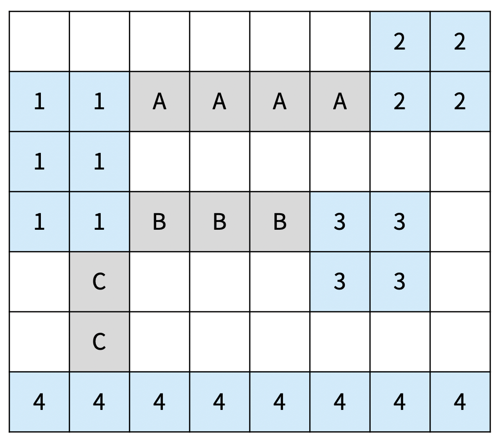
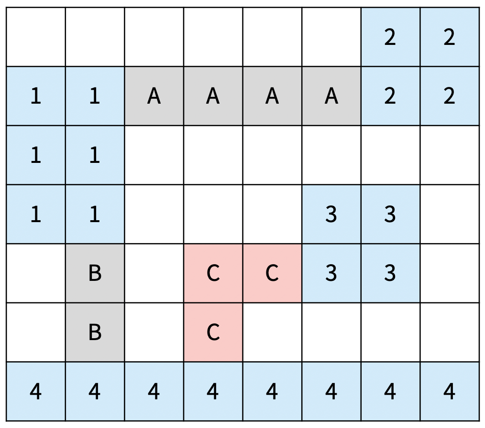
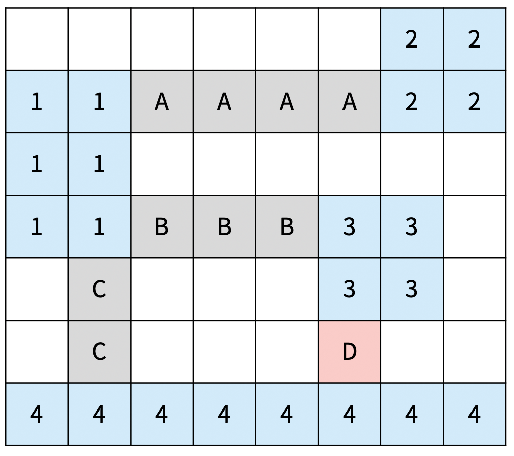
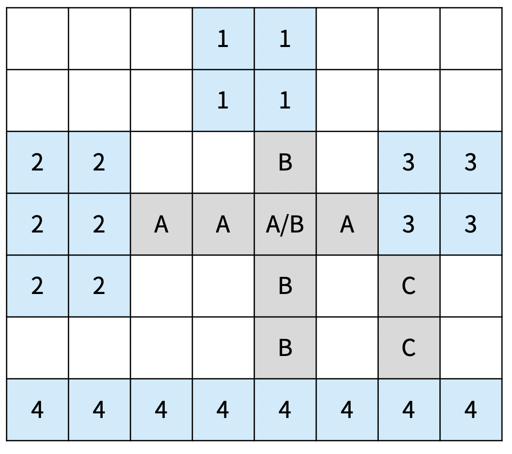

# 다리 만들기 2

### Level: 골드1


<br>

| 시간 제한 | 메모리 제한 |
| -------- | ---------- |
| 1 초 | 512 MB |

<br>

## 문제 설명

섬으로 이루어진 나라가 있고, 모든 섬을 다리로 연결하려고 한다. 이 나라의 지도는 N×M 크기의 이차원 격자로 나타낼 수 있고, 격자의 각 칸은 땅이거나 바다이다.

섬은 연결된 땅이 상하좌우로 붙어있는 덩어리를 말하고, 아래 그림은 네 개의 섬으로 이루어진 나라이다. 색칠되어있는 칸은 땅이다.

<div align="center">
  
</div>
<br>

다리는 바다에만 건설할 수 있고, 다리의 길이는 다리가 격자에서 차지하는 칸의 수이다. 다리를 연결해서 모든 섬을 연결하려고 한다. 섬 A에서 다리를 통해 섬 B로 갈 수 있을 때, 섬 A와 B를 연결되었다고 한다. 다리의 양 끝은 섬과 인접한 바다 위에 있어야 하고, 한 다리의 방향이 중간에 바뀌면 안된다. 또, 다리의 길이는 2 이상이어야 한다.

다리의 방향이 중간에 바뀌면 안되기 때문에, 다리의 방향은 가로 또는 세로가 될 수 밖에 없다. 방향이 가로인 다리는 다리의 양 끝이 가로 방향으로 섬과 인접해야 하고, 방향이 세로인 다리는 다리의 양 끝이 세로 방향으로 섬과 인접해야 한다.

섬 A와 B를 연결하는 다리가 중간에 섬 C와 인접한 바다를 지나가는 경우에 섬 C는 A, B와 연결되어있는 것이 아니다. 

아래 그림은 섬을 모두 연결하는 올바른 2가지 방법이고, 다리는 회색으로 색칠되어 있다. 섬은 정수, 다리는 알파벳 대문자로 구분했다.

<table style="width: 100%; border: 1px solid rgb(82, 82, 82); border-spacing: 0; border-collaps: collapse">
  <tbody>
    <tr>
      <td style="text-align: center; width: 50%; border: 1px solid rgb(82, 82, 82); padding: 8px">
        
      </td>
      <td style="text-align: center; width: 50%; border: 1px solid rgb(82, 82, 82); padding: 8px">
        
      </td>
    </tr>
    <tr>
      <td style="text-align: center; width: 50%; border: 1px solid rgb(82, 82, 82); padding: 8px">
        <p>다리의 총 길이: 13</p>
        <p>D는 2와 4를 연결하는 다리이고, 3과는 연결되어 있지 않다.</p>
      </td>
      <td style="text-align: center; width: 50%; border: 1px solid rgb(82, 82, 82); padding: 8px">
        <p>다리의 총 길이: 9 (최소)</p> 
      </td>
    </tr>
  </tbody>
</table>
<br>

다음은 올바르지 않은 3가지 방법이다

<table style="width: 100%; border: 1px solid rgb(82, 82, 82); border-spacing: 0; border-collaps: collapse">
  <tbody>
    <tr>
      <td style="text-align: center; width: 33%; border: 1px solid rgb(82, 82, 82); padding: 8px">
        
      </td>
      <td style="text-align: center; width: 33%; border: 1px solid rgb(82, 82, 82); padding: 8px">
        
      </td>
      <td style="text-align: center; width: 33%; border: 1px solid rgb(82, 82, 82); padding: 8px">
        
      </td>
    </tr>
    <tr>
      <td style="text-align: center; width: 33%; border: 1px solid rgb(82, 82, 82); padding: 8px">
        <p>C의 방향이 중간에 바뀌었다</p>
      </td>
      <td style="text-align: center; width: 33%; border: 1px solid rgb(82, 82, 82); padding: 8px">
       <p>D의 길이가 1이다.</p>
      </td>
      <td style="text-align: center; width: 33%; border: 1px solid rgb(82, 82, 82); padding: 8px">
        <p>가로 다리인 A가 1과 가로로 연결되어 있지 않다.</p>
      </td>
    </tr>
  </tbody>
</table>
<br>

다리가 교차하는 경우가 있을 수도 있다. 교차하는 다리의 길이를 계산할 때는 각 칸이 각 다리의 길이에 모두 포함되어야 한다. 아래는 다리가 교차하는 경우와 기타 다른 경우에 대한 2가지 예시이다.

<table style="width: 100%; border: 1px solid rgb(82, 82, 82); border-spacing: 0; border-collaps: collapse">
  <tbody>
    <tr>
      <td style="text-align: center; width: 50%; border: 1px solid rgb(82, 82, 82); padding: 
      8px">
        
      </td>
      <td style="text-align: center; width: 50%; border: 1px solid rgb(82, 82, 82); padding: 8px">
        
      </td>
    </tr>
    <tr>
      <td style="text-align: center; width: 50%; border: 1px solid rgb(82, 82, 82); padding: 8px">
        <p>A의 길이는 4이고, B의 길이도 4이다.</p>
        <p>총 다리의 총 길이: 4 + 4 + 2 = 10</p>
      </td>
      <td style="text-align: center; width: 50%; border: 1px solid rgb(82, 82, 82); padding: 8px">
        <p>다리 A: 2와 3을 연결 (길이 2)</p>
        <p>다리 B: 3과 4를 연결 (길이 3)</p>
        <p>다리 C: 2와 5를 연결 (길이 5)</p>
        <p>다리 D: 1과 2를 연결 (길이 2)</p>
        <p>총 길이: 12</p>
      </td>
    </tr>
  </tbody>
</table>
<br>

나라의 정보가 주어졌을 때, `모든 섬을 연결`하는 `다리 길이의 최솟값`을 구해보자.

## 입력 

첫째 줄에 지도의 세로 크기 N과 가로 크기 M이 주어진다. 둘째 줄부터 N개의 줄에 지도의 정보가 주어진다. 각 줄은 M개의 수로 이루어져 있으며, 수는 0 또는 1이다. 0은 바다, 1은 땅을 의미한다.

<br>

## 출력

모든 섬을 연결하는 다리 길이의 최솟값을 출력한다. 모든 섬을 연결하는 것이 불가능하면 -1을 출력한다.

<br>

## 제한

- 1 ≤ N, M ≤ 10
- 3 ≤ N×M ≤ 100
- 2 ≤ 섬의 개수 ≤ 6

<br>

**예제 입력1 & 예제 출력1**

```
7 8
0 0 0 0 0 0 1 1
1 1 0 0 0 0 1 1
1 1 0 0 0 0 0 0
1 1 0 0 0 1 1 0
0 0 0 0 0 1 1 0
0 0 0 0 0 0 0 0
1 1 1 1 1 1 1 1

```

```
9

```

**예제 입력2 & 예제 출력2**

```
7 8
0 0 0 1 1 0 0 0
0 0 0 1 1 0 0 0
1 1 0 0 0 0 1 1
1 1 0 0 0 0 1 1
1 1 0 0 0 0 0 0
0 0 0 0 0 0 0 0
1 1 1 1 1 1 1 1

```

```
10

```

**예제 입력3 & 예제 출력3**

```
7 8
1 0 0 1 1 1 0 0
0 0 1 0 0 0 1 1
0 0 1 0 0 0 1 1
0 0 1 1 1 0 0 0
0 0 0 0 0 0 0 0
0 1 1 1 0 0 0 0
1 1 1 1 1 1 0 0

```

```
9

```

**예제 입력4 & 예제 출력4**

```
7 7
1 1 1 0 1 1 1
1 1 1 0 1 1 1
1 1 1 0 1 1 1
0 0 0 0 0 0 0
1 1 1 0 1 1 1
1 1 1 0 1 1 1
1 1 1 0 1 1 1

```

```
-1

```

**예제 입력5 & 예제 출력5**

```
2 8
1 0 0 0 1 0 1 0
1 1 1 1 1 0 1 0

```

```
-1

```


---

ref: https://www.acmicpc.net/problem/17472

