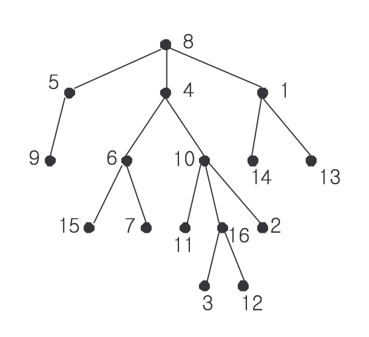

# 가장 가까운 공통 조상

### Level: 골드4


<br>

| 시간 제한 | 메모리 제한 |
| -------- | ---------- |
| 1 초 | 128 MB |

<br>

## 문제 설명

루트가 있는 트리(rooted tree)가 주어지고, 그 트리 상의 두 정점이 주어질 때 그들의 가장 가까운 공통 조상(Nearest Common Anscestor)은 다음과 같이 정의됩니다.

- 두 노드의 가장 가까운 공통 조상은, 두 노드를 모두 자손으로 가지면서 깊이가 가장 깊은(즉 두 노드에 가장 가까운) 노드를 말합니다.

<div align="center">
  
</div>
<br>

예를 들어  15와 11를 모두 자손으로 갖는 노드는 4와 8이 있지만, 그 중 깊이가 가장 깊은(15와 11에 가장 가까운) 노드는 4 이므로 가장 가까운 공통 조상은 4가 됩니다.

루트가 있는 트리가 주어지고, 두 노드가 주어질 때 그 두 노드의 가장 가까운 공통 조상을 찾는 프로그램을 작성하세요.

<br>

## 입력

첫 줄에 테스트 케이스의 개수 T가 주어집니다.

각 테스트 케이스마다, 첫째 줄에 트리를 구성하는 노드의 수 N이 주어집니다. (2 ≤ N ≤ 10,000)

그리고 그 다음 N-1개의 줄에 트리를 구성하는 간선 정보가 주어집니다. 한 간선 당 한 줄에 두 개의 숫자 A B 가 순서대로 주어지는데, 이는 A가 B의 부모라는 뜻입니다. (당연히 정점이 N개인 트리는 항상 N-1개의 간선으로 이루어집니다!) A와 B는 1 이상 N 이하의 정수로 이름 붙여집니다.

테스트 케이스의 마지막 줄에 가장 가까운 공통 조상을 구할 두 노드가 주어집니다.

<br>

## 출력

각 테스트 케이스 별로, 첫 줄에 입력에서 주어진 두 노드의 가장 가까운 공통 조상을 출력합니다.

<br>

**예제 입력1 & 예제 출력1**

```
2
16
1 14
8 5
10 16
5 9
4 6
8 4
4 10
1 13
6 15
10 11
6 7
10 2
16 3
8 1
16 12
16 7
5
2 3
3 4
3 1
1 5
3 5

```

```
4
3

```

---

ref: https://www.acmicpc.net/problem/3584