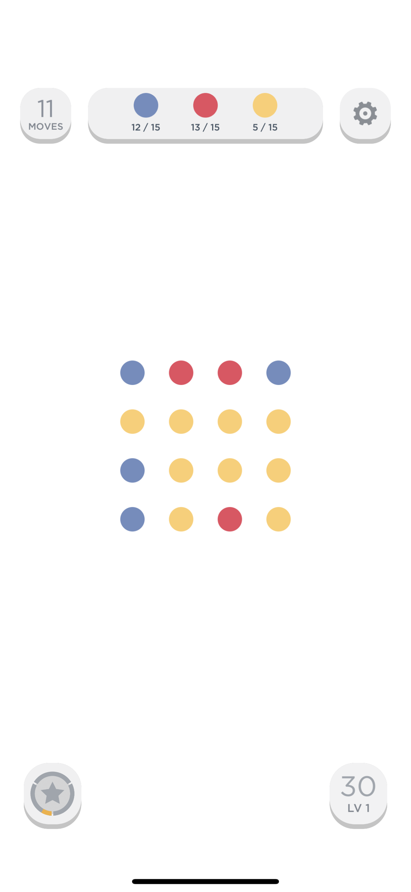
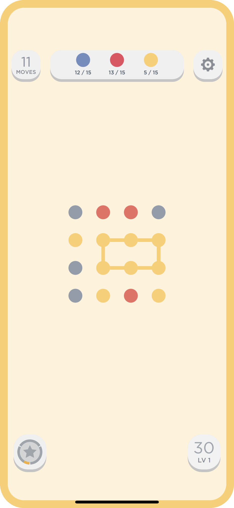
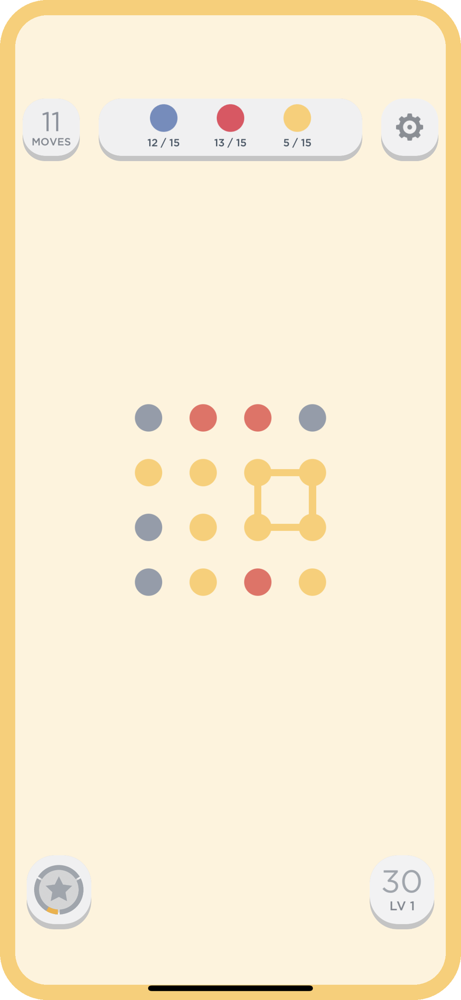

# Two Dots

### Level: 골드4


<br>

| 시간 제한 | 메모리 제한 |
| -------- | ---------- |
| 2 초 | 512 MB |

<br>

## 문제 설명

Two Dots는 Playdots, Inc.에서 만든 게임이다. 게임의 기초 단계는 크기가 N×M인 게임판 위에서 진행된다.

<div align="center">
  
</div>
<br>

각각의 칸은 색이 칠해진 공이 하나씩 있다. 이 게임의 핵심은 같은 색으로 이루어진 사이클을 찾는 것이다.

다음은 위의 게임판에서 만들 수 있는 사이클의 예시이다.

<div align="center">
  
  
</div>
<br>

점 k개 d1, d2, ..., dk로 이루어진 사이클의 정의는 아래와 같다.

- 모든 k개의 점은 서로 다르다. 
- k는 4보다 크거나 같다.
- 모든 점의 색은 같다.
- 모든 1 ≤ i ≤ k-1에 대해서, di와 di+1은 인접하다. 또, `dk와 d1도 인접`해야 한다. 두 점이 인접하다는 것은 각각의 점이 들어있는 칸이 변을 공유한다는 의미이다.

게임판의 상태가 주어졌을 때, 사이클이 존재하는지 아닌지 구해보자.

<br>

## 입력

첫째 줄에 게임판의 크기 N, M이 주어진다. 둘째 줄부터 N개의 줄에 게임판의 상태가 주어진다. 게임판은 모두 점으로 가득차 있고, 게임판의 상태는 점의 색을 의미한다. 점의 색은 알파벳 대문자 한 글자이다.

<br>

## 출력

사이클이 존재하는 경우에는 "Yes", 없는 경우에는 "No"를 출력한다.


<br>

**예제 입력1 & 예제 출력1**

```
3 4
AAAA
ABCA
AAAA

```

```
Yes

```

**예제 입력2 & 예제 출력2**

```
3 4
AAAA
ABCA
AADA

```

```
No

```

**예제 입력3 & 예제 출력3**

```
4 4
YYYR
BYBY
BBBY
BBBY

```

```
Yes

```

**예제 입력4 & 예제 출력4**

```
7 6
AAAAAB
ABBBAB
ABAAAB
ABABBB
ABAAAB
ABBBAB
AAAAAB

```

```
Yes

```

**예제 입력5 & 예제 출력5**

```
2 13
ABCDEFGHIJKLM
NOPQRSTUVWXYZ

```

```
No

```

---

ref: https://www.acmicpc.net/problem/16929