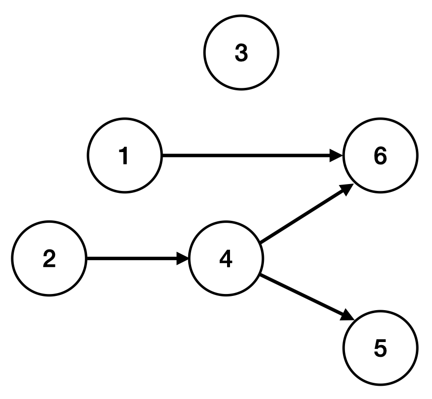

# 작업

### Level: 실버1


| 시간 제한 | 메모리 제한 |
| -------- | ---------- |
| 1 초 | 512 MB |

## 문제 설명

민상이는 자신이 해야할 작업 $N$개를 아래와 같이 작업 순서도로 그려보았다.



위 그림에서 5번 작업을 하기 위해 제일 먼저 2번 작업을 끝내야 하고 그 다음으로 4번 작업을 끝내야 5번 작업을 할 수 있다. 3번 작업은 먼저 해야하는 작업이 없으므로 3번 작업을 바로 시작 할 수 있다.

작업 순서를 정할때 위배되는 작업 순서는 없다. 예를 들어, A 작업을 하려면 B 작업을 먼저 해야하고, B 작업을 해야하기 전에 A 작업을 해야하는 상황은 없다.

민상이는 오늘 반드시 끝낼 작업 $X$가 있다. 민상이가 작업 $X$ 을 끝내기 위해서 먼저 해야하는 작업의 개수를 구해주자!

## 입력

민상이가 작업할 개수 $N$와 작업 순서 정보의 개수 $M$이 공백으로 구분되어 주어진다.

두 번째줄부터 $M + 1$ 줄까지 작업 $A_i$와 작업 $B_i$가 공백으로 구분되어 주어진다. 이때 두 값의 의미는 작업 $B_i$를 하기 위해서 바로 이전에 작업 $A_i$를 먼저 해야한다는 의미이다. 중복된 정보는 주어지지 않는다.

마지막 줄에는 민상이가 오늘 반드시 끝내야하는 작업 $X$가 주어진다.

## 출력

민상이가 작업 $X$를 하기 위해 먼저 해야하는 일의 개수를 출력한다.

## 제한

- $1 \le N \le 100,000$ 

- $0 \le M \le min( \frac {N×(N - 1)} {2}, 200000)$ 

- $1 \le A_i, B_i \le N$ 

- $1 \le X \le N$ 

### 예제 입력1 & 예제 출력1

```text
6 4
1 6
2 4
4 6
4 5
5

```

```text
2

```

### 예제 입력2 & 예제 출력2

```text
6 4
1 6
2 4
4 6
4 5
3

```

```text
0

```

### 예제 입력3 & 예제 출력3

```text
4 4
1 2
1 3
2 4
3 4
4

```

```text
3

```

---

ref: https://www.acmicpc.net/problem/21937