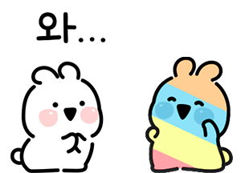
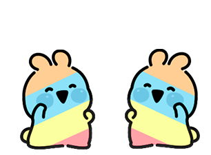

# 붙임성 좋은 총총이

### Level: 실버4


| 시간 제한 | 메모리 제한 |
| -------- | ---------- |
| 1 초 | 1024 MB |

## 문제 설명



총총이는 친구 곰곰이의 소개로 제2회 곰곰컵에 출연할 기회를 얻었다!

총총이는 자신의 묘기인 무지개 댄스를 선보여, 여러분의 환심을 사려 한다. 이 댄스는 중독성이 강하기 때문에, 한번 보게 된 사람은 모두 따라 하게 돼버린다.



사람들이 만난 기록이 시간 순서대로 
$N$개 주어진다. (총총이는 토끼이지만 이 문제에서는 편의상 사람이라고 가정한다.)

무지개 댄스를 추지 않고 있던 사람이 무지개 댄스를 추고 있던 사람을 만나게 된다면, 만난 시점 이후로 무지개 댄스를 추게 된다.

기록이 시작되기 이전 무지개 댄스를 추고 있는 사람은 총총이 뿐이라고 할 때, 마지막 기록 이후 무지개 댄스를 추는 사람이 몇 명인지 구해보자!

## 입력

첫번째 줄에는 사람들이 만난 기록의 수 $N\ (1 \le N \le 1\ 000)$이 주어진다.

두번째 줄부터 $N$개의 줄에 걸쳐 사람들이 만난 기록이 주어진다. $i + 1$번째 줄에는 $i$번째로 만난 사람들의 이름 $A_i$와 
$B_i$가 공백을 사이에 두고 주어진다. $A_i$와 $B_i$는 숫자와 영문 대소문자로 이루어진 최대 길이 $20$의 문자열이며, 서로 같지 않다.

총총이의 이름은 ChongChong으로 주어지며, 기록에서 1회 이상 주어진다.

동명이인은 없으며, 사람의 이름은 대소문자를 구분한다. (ChongChong과 chongchong은 다른 이름이다.)

## 출력

마지막 기록 이후 무지개 댄스를 추는 사람의 수를 출력하라.

### 예제 입력1 & 예제 출력1

```text
12
bnb2011 chansol
chansol chogahui05
chogahui05 jthis
jthis ChongChong
jthis jyheo98
jyheo98 lms0806
lms0806 pichulia
pichulia pjshwa
pjshwa r4pidstart
r4pidstart swoon
swoon tony9402
tony9402 bnb2011

```

```text
10

```

---

ref: https://www.acmicpc.net/problem/26069