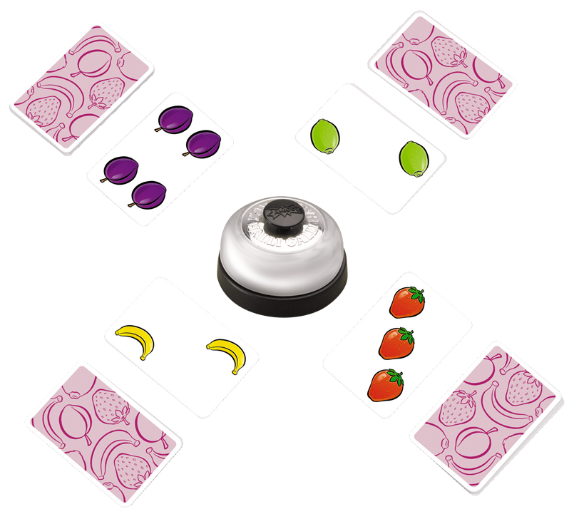

# 할리갈리

### Level: 브론즈2


| 시간 제한 | 메모리 제한 |
| -------- | ---------- |
| 1 초 | 1024 MB |

## 문제 설명



**《할리갈리》** 는 단추가 달린 종 하나와 과일이 그려진 카드들로 구성된 보드게임입니다.

카드에는 총 $4$종류의 과일이 최대 $5$개까지 그려져 있습니다. 그려진 과일의 종류는 딸기, 바나나, 라임, 그리고 자두입니다.

게임을 시작할 때 플레이어들은 카드 뭉치를 공평하게 나눠가지며 자신이 가진 카드를 전부 소모하면 패배합니다.

게임은 시작 플레이어가 본인의 카드 뭉치에서 카드 한 장을 공개하는 것으로 시작합니다. 이후 반시계 방향으로 돌아가며 본인의 카드를 한 장씩 공개합니다.

펼쳐진 카드들 중 한 종류 이상의 과일이 **정확히** $5$개 있는 경우 종을 눌러야 하며 가장 먼저 종을 누른 플레이어가 모든 카드를 모아 자신의 카드 뭉치 아래에 놓습니다. 종을 잘못 누른 경우 다른 모든 플레이어에게 카드를 한 장씩 나누어줘야 합니다.

《할리갈리》를 처음 해보는 한별이는 할리갈리 고수인 히나에게 이기기 위해 여러분에게 도움을 청했습니다. 한별이를 도와 펼쳐진 카드들의 목록이 주어졌을 때, 한별이가 종을 쳐야 하는지 알려주세요.

## 입력

첫 번째 줄에 펼쳐진 카드의 개수 $N$이 주어집니다.

두 번째 줄부터 $N$개의 줄에 걸쳐 한 줄에 하나씩 펼쳐진 카드의 정보가 주어집니다.

카드의 정보는 공백으로 구분된, 과일의 종류를 나타내는 문자열 $S$와 과일의 개수를 나타내는 양의 정수 $X$로 이루어져 있습니다. 

$S$는 STRAWBERRY, BANANA, LIME, PLUM 중 하나입니다.

## 출력

한별이가 종을 쳐야 하면 YES을, 아니면 NO를 출력해주세요.

## 제한

- $1 \le N \le 100\,000$ 
 
- $1 \le X \le 5$ 

- 입력으로 주어지는 모든 수는 정수입니다.

### 예제 입력1 & 예제 출력1

```text
3
BANANA 2
PLUM 4
BANANA 3

```

```text
YES

```

### 예제 입력2 & 예제 출력2

```text
4
STRAWBERRY 1
BANANA 2
LIME 3
PLUM 4

```

```text
NO

```

### 예제 입력3 & 예제 출력3

```text
2
LIME 5
LIME 1

```

```text
NO

```

### 예제 입력4 & 예제 출력4

```text
2
BANANA 5
BANANA 5

```

```text
NO

```

---

ref: https://www.acmicpc.net/problem/27160