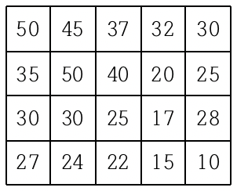
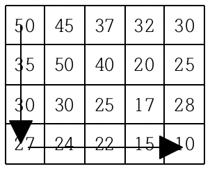
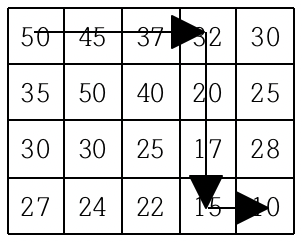
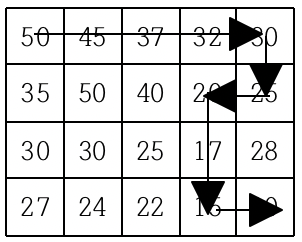

# 내리막 길

### Level: 골드3


<br>

| 시간 제한 | 메모리 제한 |
| -------- | ---------- |
| 2 초 | 128 MB |

<br>

## 문제 설명

여행을 떠난 세준이는 지도를 하나 구하였다. 이 지도는 아래 그림과 같이 직사각형 모양이며 여러 칸으로 나뉘어져 있다. 한 칸은 한 지점을 나타내는데 각 칸에는 그 지점의 높이가 쓰여 있으며, 각 지점 사이의 이동은 지도에서 상하좌우 이웃한 곳끼리만 가능하다.


<br>

현재 제일 왼쪽 위 칸이 나타내는 지점에 있는 세준이는 제일 오른쪽 아래 칸이 나타내는 지점으로 가려고 한다. 그런데 가능한 힘을 적게 들이고 싶어 항상 높이가 더 낮은 지점으로만 이동하여 목표 지점까지 가고자 한다. 위와 같은 지도에서는 다음과 같은 세 가지 경로가 가능하다.

<div style="text-align: center">
  
  
  
</div>
<br>

지도가 주어질 때 이와 같이 제일 왼쪽 위 지점에서 출발하여 제일 오른쪽 아래 지점까지 항상 내리막길로만 이동하는 경로의 개수를 구하는 프로그램을 작성하시오.

<br>

## 입력

첫째 줄에는 지도의 세로의 크기 `M`과 가로의 크기 `N`이 빈칸을 사이에 두고 주어진다. 이어 다음 M개 줄에 걸쳐 한 줄에 N개씩 위에서부터 차례로 각 지점의 높이가 빈 칸을 사이에 두고 주어진다. M과 N은 각각 500이하의 자연수이고, 각 지점의 높이는 10000이하의 자연수이다.

<br>

## 출력

첫째 줄에 이동 가능한 경로의 수 H를 출력한다. 모든 입력에 대하여 H는 10억 이하의 음이 아닌 정수이다.

<br>

**예제 입력1 & 예제 출력1**

```
4 5
50 45 37 32 30
35 50 40 20 25
30 30 25 17 28
27 24 22 15 10

```

```
3

```

---

ref: https://www.acmicpc.net/problem/1520