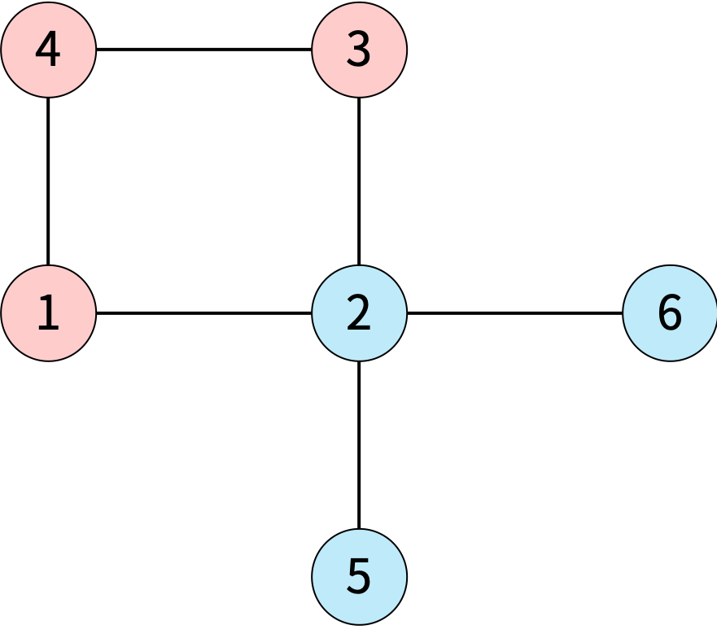
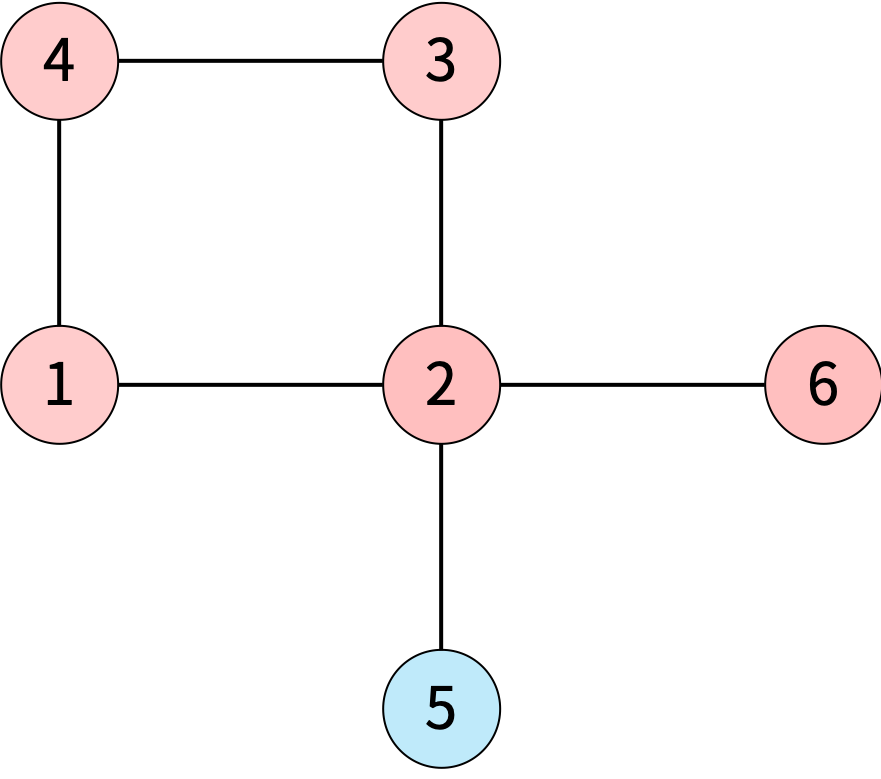
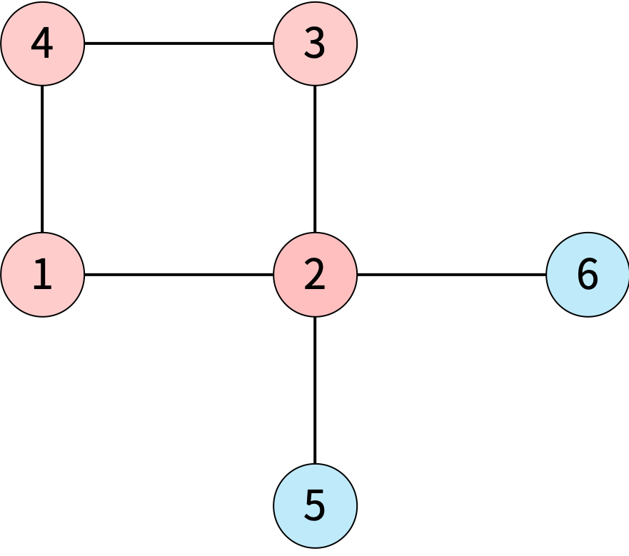
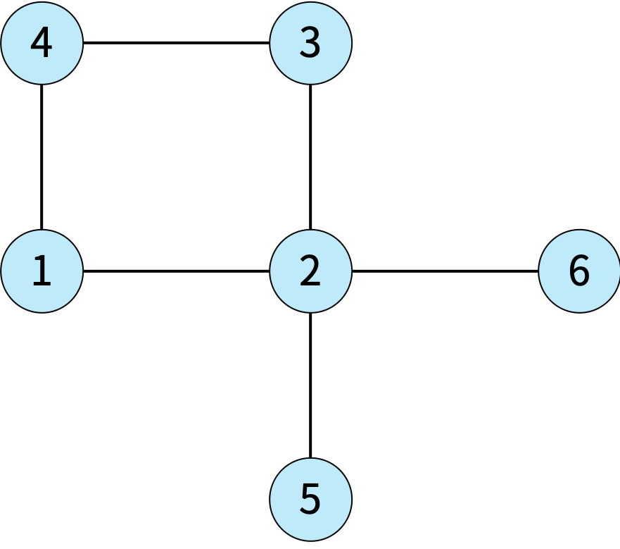

# 게리맨더링

### Level: 골드3


<br>

| 시간 제한 | 메모리 제한 |
| -------- | ---------- |
| 0.5 초 | 512 MB |

<br>

## 문제 설명

백준시의 시장 최백준은 지난 몇 년간 게리맨더링을 통해서 자신의 당에게 유리하게 선거구를 획정했다. 견제할 권력이 없어진 최백준은 권력을 매우 부당하게 행사했고, 심지어는 시의 이름도 백준시로 변경했다. 이번 선거에서는 최대한 공평하게 선거구를 획정하려고 한다.

백준시는 N개의 구역으로 나누어져 있고, 구역은 1번부터 N번까지 번호가 매겨져 있다. 구역을 두 개의 선거구로 나눠야 하고, 각 구역은 두 선거구 중 하나에 포함되어야 한다. 선거구는 구역을 적어도 하나 포함해야 하고, 한 선거구에 포함되어 있는 구역은 모두 연결되어 있어야 한다. 구역 A에서 인접한 구역을 통해서 구역 B로 갈 수 있을 때, 두 구역은 연결되어 있다고 한다. 중간에 통하는 인접한 구역은 0개 이상이어야 하고, 모두 같은 선거구에 포함된 구역이어야 한다.

아래 그림은 6개의 구역이 있는 것이고, 인접한 구역은 선으로 연결되어 있다.


<br>

아래는 백준시를 두 선거구로 나눈 4가지 방법이며, 가능한 방법과 불가능한 방법에 대한 예시이다.

<table style="margin: 0 auto; border: 1px solid rgb(82, 82, 82); border-spacing: 0; border-collaps: collapse">
  <tbody>
    <tr>
      <td style="text-align: center; width: 25%; border: 1px solid rgb(82, 82, 82); padding: 8px">
        
      </td>
      <td style="text-align: center; width: 25%; border: 1px solid rgb(82, 82, 82); padding: 8px">
        
      </td>
      <td style="text-align: center; width: 25%; border: 1px solid rgb(82, 82, 82); padding: 8px">
        
      </td>
      <td style="text-align: center; width: 25%; border: 1px solid rgb(82, 82, 82); padding: 8px">
        
      </td>
    </tr>
    <tr>
      <td style="text-align: center; width: 25%; border: 1px solid rgb(82, 82, 82); padding: 8px">
        <p>가능한 방법</p>
        <p>[1, 3, 4]와 [2, 5, 6]으로 나누어져 있다.</p>
      </td>
      <td style="text-align: center; width: 25%; border: 1px solid rgb(82, 82, 82); padding: 8px">
        <p>가능한 방법</p>
        <p>[1, 2, 3, 4, 6]과 [5]로 나누어져 있다.</p>
      </td>
      <td style="text-align: center; width: 25%; border: 1px solid rgb(82, 82, 82); padding: 8px">
        <p>불가능한 방법</p>
        <p>[1, 2, 3, 4]와 [5, 6]으로 나누어져 있는데, 5와 6이 연결되어 있지 않다.</p>
      </td>
      <td style="text-align: center; width: 25%; border: 1px solid rgb(82, 82, 82); padding: 8px">
        <p>불가능한 방법</p>
        <p>각 선거구는 적어도 하나의 구역을 포함해야 한다.</p>
      </td>
    </tr>
  </tbody>
</table>

<br>

공평하게 선거구를 나누기 위해 두 선거구에 포함된 인구의 차이를 최소로 하려고 한다. 백준시의 정보가 주어졌을 때, 인구 차이의 최솟값을 구해보자.

<br>

## 입력

첫째 줄에 구역의 개수 `N`이 주어진다. 둘째 줄에 구역의 인구가 1번 구역부터 N번 구역까지 순서대로 주어진다. 인구는 공백으로 구분되어져 있다.

셋째 줄부터 N개의 줄에 각 구역과 인접한 구역의 정보가 주어진다. 각 정보의 첫 번째 정수는 그 구역과 인접한 구역의 수이고, 이후 인접한 구역의 번호가 주어진다. 모든 값은 정수로 구분되어져 있다.

구역 A가 구역 B와 인접하면 구역 B도 구역 A와 인접하다. 인접한 구역이 없을 수도 있다.

<br>

## 출력

첫째 줄에 백준시를 두 선거구로 나누었을 때, 두 선거구의 인구 차이의 최솟값을 출력한다. 두 선거구로 나눌 수 없는 경우에는 -1을 출력한다.

<br>

## 제한

- 2 ≤ N ≤ 10
- 1 ≤ 구역의 인구 수 ≤ 100

<br>

**예제 입력1 & 예제 출력1**

```
6
5 2 3 4 1 2
2 2 4
4 1 3 6 5
2 4 2
2 1 3
1 2
1 2

```

```
1

```

선거구를 [1, 4], [2, 3, 5, 6]으로 나누면 각 선거구의 인구는 9, 8이 된다. 인구 차이는 1이고, 이 값보다 더 작은 값으로 선거구를 나눌 수는 없다.

**예제 입력2 & 예제 출력2**

```
6
1 1 1 1 1 1
2 2 4
4 1 3 6 5
2 4 2
2 1 3
1 2
1 2

```

```
0

```

선거구를 [1, 3, 4], [2, 5, 6]으로 나누면 인구 차이가 0이다.

**예제 입력3 & 예제 출력3**

```
6
10 20 10 20 30 40
0
0
0
0
0
0

```

```
-1

```

두 선거구로 나눌 수 있는 방법이 없다.

**예제 입력4 & 예제 출력4**

```
6
2 3 4 5 6 7
2 2 3
2 1 3
2 1 2
2 5 6
2 4 6
2 4 5

```

```
9

```

<br>

## 노트

게리맨더링은 특정 후보자나 정당에 유리하게 선거구를 획정하는 것을 의미한다.

---

ref: https://www.acmicpc.net/problem/17471