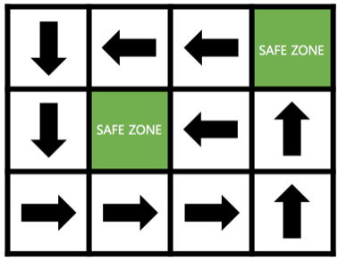

# 피리 부는 사나이

### Level: 골드3


<br>

| 시간 제한 | 메모리 제한 |
| -------- | ---------- |
| 1 초 | 256 MB |

<br>

## 문제 설명

피리 부는 사나이 성우는 오늘도 피리를 분다.

성우가 피리를 불 때면 영과일 회원들은 자기도 모르게 성우가 정해놓은 방향대로 움직이기 시작한다. 성우가 정해놓은 방향은 총 4가지로 U, D, L, R이고 각각 위, 아래, 왼쪽, 오른쪽으로 이동하게 한다.

이를 지켜보던 재훈이는 더 이상 움직이기 힘들어하는 영과일 회원들을 지키기 위해 특정 지점에 ‘SAFE ZONE’ 이라는 최첨단 방음 시설을 만들어 회원들이 성우의 피리 소리를 듣지 못하게 하려고 한다. 하지만 예산이 넉넉하지 않은 재훈이는 성우가 설정해 놓은 방향을 분석해서 최소 개수의 ‘SAFE ZONE’을 만들려 한다. 

성우가 설정한 방향 지도가 주어졌을 때 재훈이를 도와서 영과일 회원들이 지도 어느 구역에 있더라도 성우가 피리를 불 때 ‘SAFE ZONE’에 들어갈 수 있게 하는 ‘SAFE ZONE’의 최소 개수를 출력하는 프로그램을 작성하시오.

<div align="center">
  
</div>
<br>

다음과 같이 'SAFE ZONE'을 만들면 영과일 회원들이 지도 어느 구역에 있더라도 'SAFE ZONE'에 들어갈 수 있다.

<br>

## 입력

첫 번째 줄에 지도의 행의 수를 나타내는 N(1 ≤ N ≤ 1,000)과 지도의 열의 수를 나타내는 M(1 ≤ M ≤ 1,000)이 주어진다.

두 번째 줄부터 N개의 줄에 지도의 정보를 나타내는 길이가 M인 문자열이 주어진다.

지도 밖으로 나가는 방향의 입력은 주어지지 않는다.

<br>

## 출력

첫 번째 줄에 ‘SAFE ZONE’의 최소 개수를 출력한다.

<br>

**예제 입력1 & 예제 출력1**

```
3 4
DLLL
DRLU
RRRU

```

```
2

```

---

ref: https://www.acmicpc.net/problem/16724