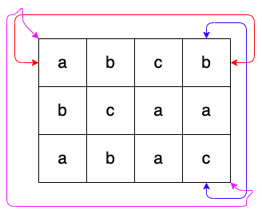

# 점프 점프

### Level: 골드4


| 시간 제한 | 메모리 제한 |
| -------- | ---------- |
| 1 초 | 512 MB |

## 문제 설명

_하루 종일 내리는 비에 세상이 출렁이고 구름이 해를 먹어 밤인지 낮인지 모르는 어느 여름 날_

잠 들기 싫어 버티던 호석이는 무거운 눈꺼풀에 패배했다. 정신을 차려보니 바닥에는 격자 모양의 타일이 가득한 세상이었고, 각 타일마다 알파벳 소문자가 하나씩 써있다더라. 두려움에 가득해 미친듯이 앞만 보고 달려 끝을 찾아 헤맸지만 이 세상은 끝이 없었고, 달리다 지쳐 바닥에 드러누우니 하늘에 이런 문구가 핏빛 구름으로 떠다니고 있었다.

- 이 세상은 N행 M열의 격자로 생겼으며, 각 칸에 알파벳이 써있고 환형으로 이어진다. 왼쪽 위를 (1, 1), 오른쪽 아래를 (N, M)이라고 하자.

- 너는 아무 곳에서나 시작해서 상하좌우나 대각선 방향의 칸으로 한 칸씩 이동할 수 있다. 이 때, 이미 지나 왔던 칸들을 다시 방문하는 것은 허용한다.

- 시작하는 격자의 알파벳을 시작으로, 이동할 때마다 각 칸에 써진 알파벳을 이어 붙여서 문자열을 만들 수 있다.

- 이 곳의 신인 내가 좋아하는 문자열을 K 개 알려줄 터이니, 각 문자열 마다 너가 만들 수 있는 경우의 수를 잘 대답해야 너의 세계로 돌아갈 것이다.

- 경우의 수를 셀 때, 방문 순서가 다르면 다른 경우이다. 즉, (1,1)->(1,2) 로 가는 것과 (1,2)->(1,1) 을 가는 것은 서로 다른 경우이다.

호석이는 하늘을 보고서 _"환형이 무엇인지는 알려달라!"_ 며 소리를 지르니 핏빛 구름이 흩어졌다가 모이며 아래와 같은 말을 그렸다.

- 너가 1행에서 위로 가면 N 행으로 가게 되며 반대도 가능하다.

- 너가 1열에서 왼쪽으로 가면 M 열로 가게 되며 반대도 가능하다.

- 대각선 방향에 대해서도 동일한 규칙이 적용된다.

- 하늘에 아래와 같은 그림을 구름으로 그려줄 터이니 이해해 돕도록 하여라.

- 예를 들어서, 너가 (1, 1)에서 위로 가면 (N, 1)이고, 왼쪽으로 가면 (1, M)이며 왼쪽 위 대각선 방향으로 가면 (N, M)인 것이다.



세상을 이루는 격자의 정보와, K 개의 문자열이 주어졌을 때, 호석이가 대답해야 하는 정답을 구해주도록 하자.

## 입력

첫번째 줄에 격자의 크기 N, M과 신이 좋아하는 문자열의 개수 K 가 주어진다.

다음에 N개의 줄에 걸쳐서 M개의 알파벳 소문자가 공백없이 주어진다. 여기서의 첫 번째 줄은 1행의 정보이며, N 번째 줄은 N행의 정보이다.

이어서 K개의 줄에 걸쳐서 신이 좋아하는 문자열이 주어진다. 모두 알파벳 소문자로 이루어져 있다.

## 출력

K개의 줄에 걸쳐서, 신이 좋아하는 문자열을 만들 수 있는 경우의 수를 순서대로 출력한다.

## 제한

- 3 ≤ N, M ≤ 10, N과 M은 자연수이다.

- 1 ≤ K ≤ 1,000, K는 자연수이다.

- 1 ≤ 신이 좋아하는 문자열의 길이 ≤ 5

- 신이 좋아하는 문자열은 중복될 수도 있다.

### 예제 입력1 & 예제 출력1

```text
3 3 2
aaa
aba
aaa
aa
bb

```

```text
56
0

```

### 예제 입력2 & 예제 출력2

```text
3 4 3
abcb
bcaa
abac
aba
abc
cab

```

```text
66
32
38

```

---

ref: https://www.acmicpc.net/problem/20166