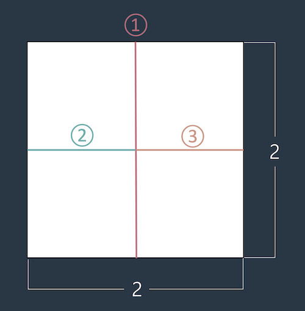

# 종이 자르기

### Level: 0

 

## 문제 설명

머쓱이는 큰 종이를 1 x 1 크기로 자르려고 합니다. 예를 들어 2 x 2 크기의 종이를 1 x 1 크기로 자르려면 최소 가위질 세 번이 필요합니다.

정수 `M`, `N`이 매개변수로 주어질 때, `M` x `N` 크기의 종이를 최소로 가위질 해야하는 횟수를 return 하도록 solution 함수를 완성해보세요.

 

## 제한사항

- 0 < `M`, `N` < 100

- 종이를 겹쳐서 자를 수 없습니다.

 

## 입출력

| M | N | result |
| - | - | ------ |
| 2 | 2 | 3      |
| 2 | 5 | 9      |
| 1 | 1 | 0      |

**입출력 예 #1**

- 본문과 동일합니다.

**입출력 예 #2**

- 가로 2 세로 5인 종이는 가로로 1번 세로로 8번 총 가위질 9번이 필요합니다.

**입출력 예 #3**

- 이미 1 * 1 크기이므로 0을 return 합니다.

---

**Ref**: https://school.programmers.co.kr/learn/courses/30/lessons/120922