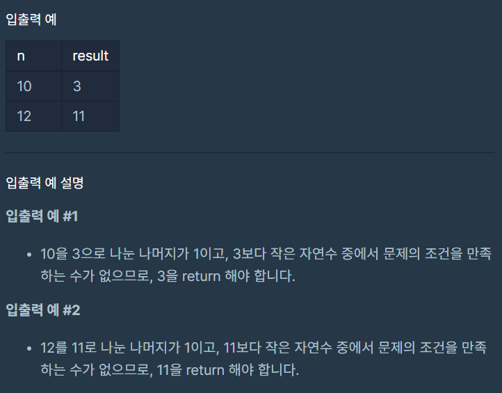

# 나머지가 1이 되는 수 찾기

### Level: 1

 

## 문제 설명

자연수 `n`이 매개변수로 주어집니다. `n`을 `x`로 나눈 나머지가 1이 되도록 하는 가장 작은 자연수 `x`를 return 하도록 solution 함수를 완성해주세요. 답이 항상 존재함은 증명될 수 있습니다.

 

## 제한사항

- 3 ≤ n ≤ 1,000,000

 

## 입출력

---
**Ref**: https://school.programmers.co.kr/learn/courses/30/lessons/87389
