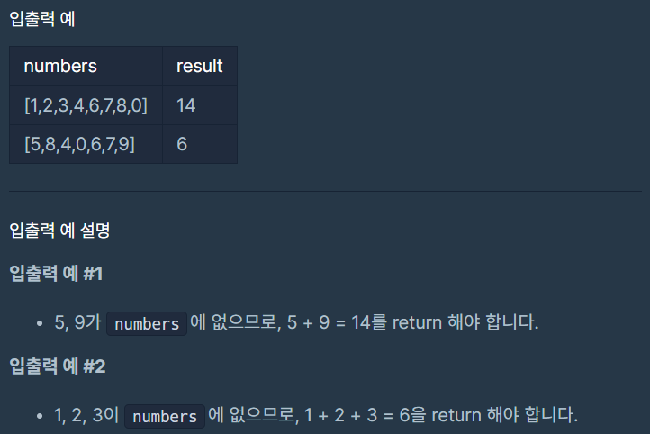

# 없는 숫자 더하기

### Level: 1

 

## 문제 설명

0부터 9까지의 숫자 중 일부가 들어있는 정수 배열 `numbers`가 매개변수로 주어집니다. `numbers`에서 찾을 수 없는 0부터 9까지의 숫자를 모두 찾아 더한 수를 return 하도록 solution 함수를 완성해주세요.

 

## 제한사항

- 1 ≤ `numbers`의 길이 ≤ 9
  - 0 ≤ `numbers`의 모든 원소 ≤ 9
  - `numbers`의 모든 원소는 서로 다릅니다.

 

## 입출력

---

**Ref**: https://school.programmers.co.kr/learn/courses/30/lessons/86051