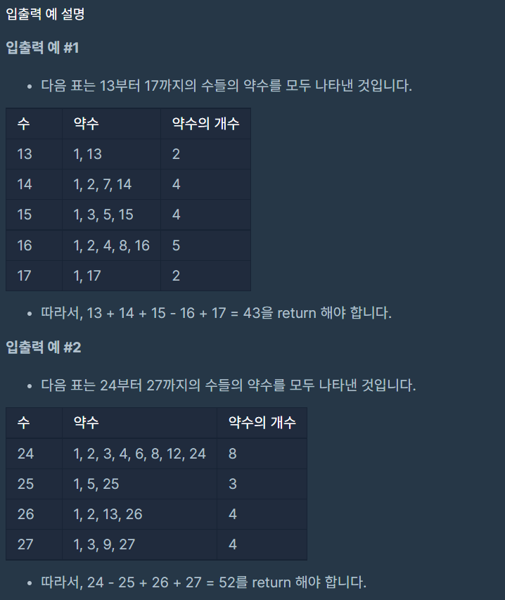

# 약수의 개수와 덧셈

### Level: 1

 

## 문제 설명

두 정수 `left`와 `right`가 매개변수로 주어집니다. `left`부터 `right`까지의 모든 수들 중에서, 약수의 개수가 짝수인 수는 더하고, 약수의 개수가 홀수인 수는 뺀 수를 return 하도록 solution 함수를 완성해주세요.

 

## 제한사항

- 1 ≤ left ≤ right ≤ 1,000

 

## 입출력

---

**Ref**: https://school.programmers.co.kr/learn/courses/30/lessons/77884
