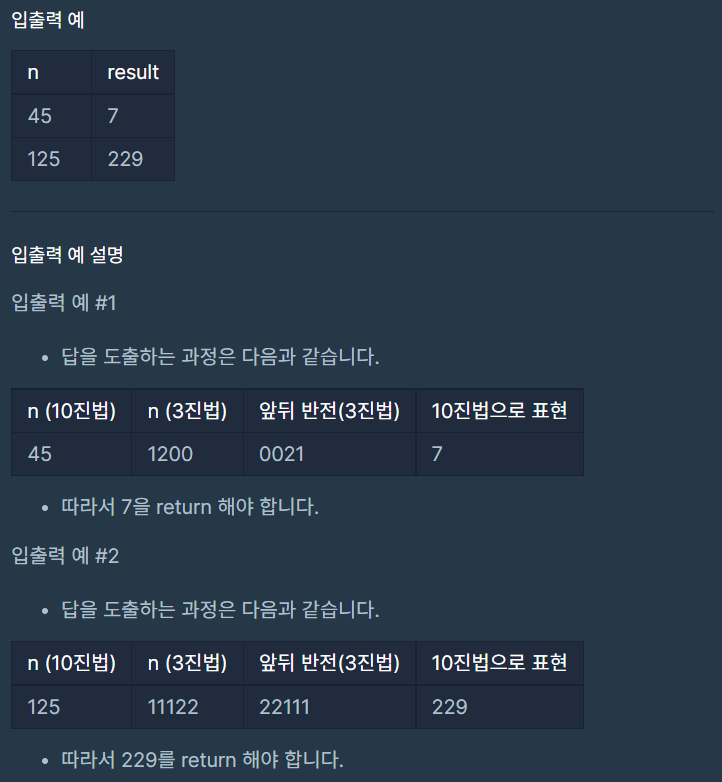

# 3진법 뒤집기

### Level: 1

 

## 문제 설명

자연수 n이 매개변수로 주어집니다. n을 3진법 상에서 앞뒤로 뒤집은 후, 이를 다시 10진법으로 표현한 수를 return 하도록 solution 함수를 완성해주세요.

 

## 제한사항

- n은 1 이상 100,000,000 이하인 자연수입니다.

 

## 입출력

---

**Ref**: https://school.programmers.co.kr/learn/courses/30/lessons/68935
