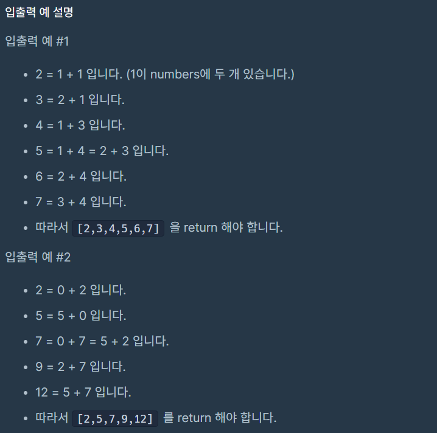

# 두 개 뽑아서 더하기

### Level: 1

 

## 문제 설명

정수 배열 numbers가 주어집니다. numbers에서 서로 다른 인덱스에 있는 두 개의 수를 뽑아 더해서 만들 수 있는 모든 수를 배열에 오름차순으로 담아 return 하도록 solution 함수를 완성해주세요

 

## 제항사항

- numbers의 길이는 2 이상 100 이하입니다.
  - numbers의 모든 수는 0 이상 100 이하입니다.

 

## 입출력

---

**Ref**: https://school.programmers.co.kr/learn/courses/30/lessons/68644