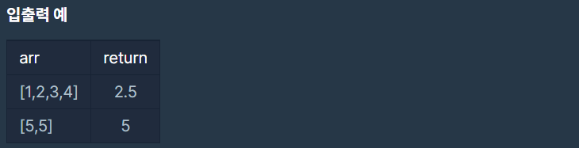

# 평균 구하기

### Level: 1

 

## 문제 설명

정수를 담고 있는 배열 arr의 평균값을 return하는 함수, solution을 완성해보세요.

 

## 제한사항

- arr은 길이 1 이상, 100 이하인 배열입니다.

- arr의 원소는 -10,000 이상 10,000 이하인 정수입니다.

 

## 입출력

---

**Ref**: https://school.programmers.co.kr/learn/courses/30/lessons/12944