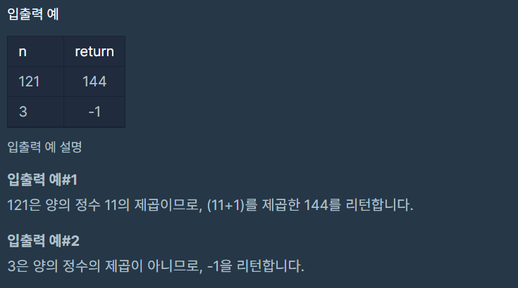

# 정수 제곱근 판별

### Level: 1

 

## 문제 설명

임의의 양의 정수 n에 대해, n이 어떤 양의 정수 x의 제곱인지 아닌지 판단하려 합니다.
n이 양의 정수 x의 제곱이라면 x+1의 제곱을 리턴하고, n이 양의 정수 x의 제곱이 아니라면 -1을 리턴하는 함수를 완성하세요.

 

## 제한사항

- n은 1이상, 50000000000000 이하인 양의 정수입니다.

 

## 입출력

---

**Ref**: https://school.programmers.co.kr/learn/courses/30/lessons/12934