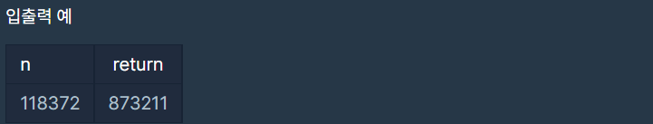

# 정수 내림차순으로 배치하기

### Level: 1

 

## 문제 설명

함수 solution은 정수 n을 매개변수로 입력받습니다. n의 각 자릿수를 큰것부터 작은 순으로 정렬한 새로운 정수를 리턴해주세요. 예를들어 n이 118372면 873211을 리턴하면 됩니다.

 

## 제한사항

- `n`은 1이상 8000000000 이하인 자연수입니다.

 

## 입출력

---

**Ref**: https://school.programmers.co.kr/learn/courses/30/lessons/12933