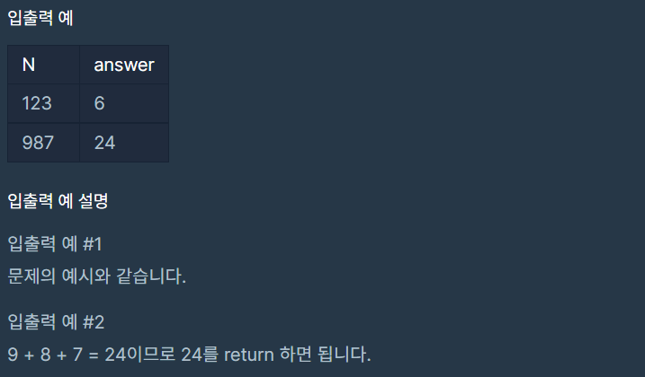

# 자릿수 더하기

### Level: 1

 

## 문제 설명

자연수 N이 주어지면, N의 각 자릿수의 합을 구해서 return 하는 solution 함수를 만들어 주세요.
예를들어 N = 123이면 1 + 2 + 3 = 6을 return 하면 됩니다.

 

## 제한사항

- N의 범위 : 100,000,000 이하의 자연수

 

## 입출력

---

**Ref**: https://school.programmers.co.kr/learn/courses/30/lessons/12931