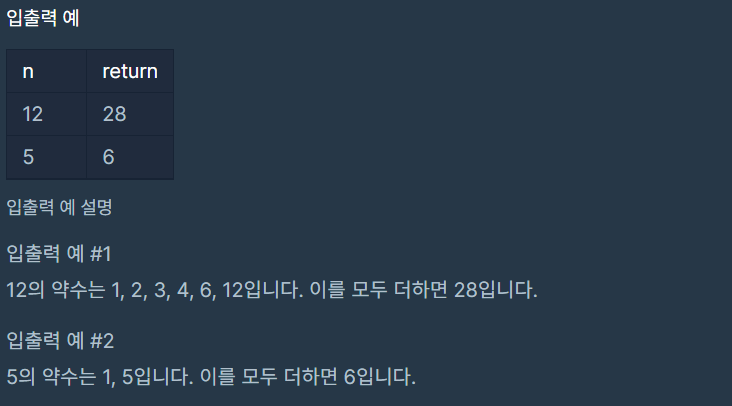

# 약수의 합

### Level: 1

 

## 문제 설명

정수 n을 입력받아 n의 약수를 모두 더한 값을 리턴하는 함수, solution을 완성해주세요.

 

## 제한사항

- `n`은 0 이상 3000이하인 정수입니다.

 

## 입출력

---

**Ref**: https://school.programmers.co.kr/learn/courses/30/lessons/12928