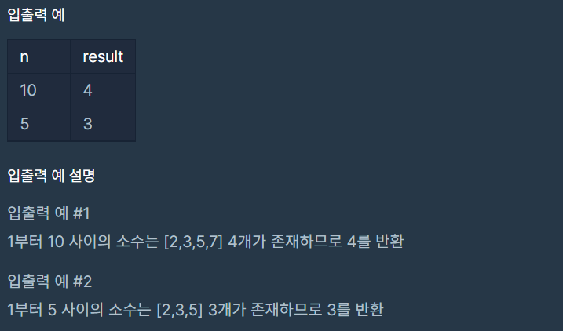

# 소수 찾기

### Level: 1

 

## 문제 설명

1부터 입력받은 숫자 n 사이에 있는 소수의 개수를 반환하는 함수, solution을 만들어 보세요.

소수는 1과 자기 자신으로만 나누어지는 수를 의미합니다.
(1은 소수가 아닙니다.)

 

## 제한사항

- n은 2이상 1000000이하의 자연수입니다.

 

## 입출력

---

**Ref**: https://school.programmers.co.kr/learn/courses/30/lessons/12921