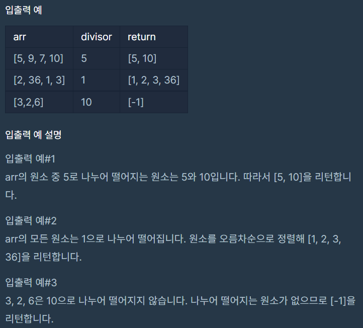

# 나누어 떨어지는 숫자 배열

### Level: 1

 

## 문제 설명

array의 각 element 중 divisor로 나누어 떨어지는 값을 오름차순으로 정렬한 배열을 반환하는 함수, solution을 작성해주세요.
divisor로 나누어 떨어지는 element가 하나도 없다면 배열에 -1을 담아 반환하세요.

 

## 제한사항

- arr은 자연수를 담은 배열입니다.

- 정수 i, j에 대해 i ≠ j 이면 arr[i] ≠ arr[j] 입니다.

- divisor는 자연수입니다.

- array는 길이 1 이상인 배열입니다.

 

## 입출력

---

**Ref**: https://school.programmers.co.kr/learn/courses/30/lessons/12910