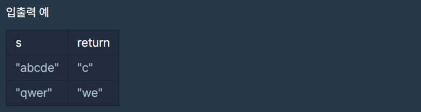

# 가운데 글자 가져오기

### Level: 1

 

## 문제 설명

단어 s의 가운데 글자를 반환하는 함수, solution을 만들어 보세요. 단어의 길이가 짝수라면 가운데 두글자를 반환하면 됩니다.

 

## 제한사항

- s는 길이가 1 이상, 100이하인 스트링입니다.

 

## 입출력

---

**Ref**: https://school.programmers.co.kr/learn/courses/30/lessons/12903