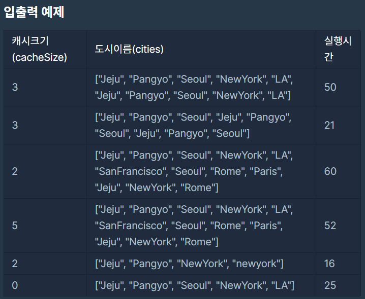

# [1차] 캐시

### Level: 2

 

## 문제 설명

지도개발팀에서 근무하는 제이지는 지도에서 도시 이름을 검색하면 해당 도시와 관련된 맛집 게시물들을 데이터베이스에서 읽어 보여주는 서비스를 개발하고 있다.
이 프로그램의 테스팅 업무를 담당하고 있는 어피치는 서비스를 오픈하기 전 각 로직에 대한 성능 측정을 수행하였는데, 제이지가 작성한 부분 중 데이터베이스에서 게시물을 가져오는 부분의 실행시간이 너무 오래 걸린다는 것을 알게 되었다.
어피치는 제이지에게 해당 로직을 개선하라고 닦달하기 시작하였고, 제이지는 DB 캐시를 적용하여 성능 개선을 시도하고 있지만 캐시 크기를 얼마로 해야 효율적인지 몰라 난감한 상황이다.

어피치에게 시달리는 제이지를 도와, DB 캐시를 적용할 때 캐시 크기에 따른 실행시간 측정 프로그램을 작성하시오.

 

## 입력 형식

- 캐시 크기(`cacheSize`)와 도시이름 배열(`cities`)을 입력받는다.

- `cacheSize`는 정수이며, 범위는 0 ≦ `cacheSize` ≦ 30 이다.

- `cities`는 도시 이름으로 이뤄진 문자열 배열로, 최대 도시 수는 100,000개이다.

- 각 도시 이름은 공백, 숫자, 특수문자 등이 없는 영문자로 구성되며, 대소문자 구분을 하지 않는다. 도시 이름은 최대 20자로 이루어져 있다.

 

## 출력 형식

- 입력된 도시이름 배열을 순서대로 처리할 때, "총 실행시간"을 출력한다.

 

## 제한사항

- 캐시 교체 알고리즘은 `LRU`(Least Recently Used)를 사용한다.

- `cache hit`일 경우 실행시간은 `1`이다.

- `cache miss`일 경우 실행시간은 `5`이다.

 

## 입출력

 

## LRU?

페이지 교체 알고리즘의 예로, `FIFO`, `LFU`, `LRU` 알고리즘 등이 있습니다.

- FIFO : 페이지가 주기억장치에 `적재된 시간을 기준`으로 교체될 페이지를 선정하는 기법

  단점 : 중요한 페이지가 오래 있었다는 이유만으로 교체되는 불합리. 가장 오래 있었던 페이지는 앞으로 계속 사용될 가능성이 있음.

- LFU : 가장 `적은 횟수를 참조`하는 페이지를 교체

  단점 : 참조될 가능성이 많음에도 불구하고 횟수에 의한 방법이므로 최근에 사용된 프로그램을 교체시킬 가능성이 있고, 해당 횟수를 증가시키므로 오버헤드 발생

- LRU : 가장 `오랫동안 참조되지 않은` 페이지를 교체

  단점 : 프로세스가 주기억장치에 접근할 때마다 참조된 페이지에 대한 시간을 기록해야함. 큰 오버헤드가 발생

---

**Ref**: https://school.programmers.co.kr/learn/courses/30/lessons/17680