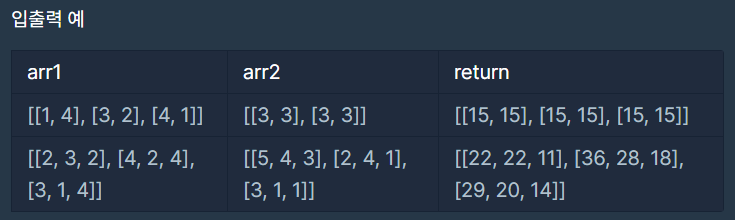

# 행렬의 곱셈

### Level: 2

 

## 문제 설명

2차원 행렬 arr1과 arr2를 입력받아, arr1에 arr2를 곱한 결과를 반환하는 함수, solution을 완성해주세요.

 

## 제한사항

- 행렬 arr1, arr2의 행과 열의 길이는 2 이상 100 이하입니다.

- 행렬 arr1, arr2의 원소는 -10 이상 20 이하인 자연수입니다.

- 곱할 수 있는 배열만 주어집니다.

 

## 입출력

---

**Ref**: https://school.programmers.co.kr/learn/courses/30/lessons/12949