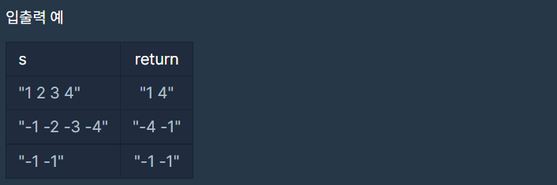

# 쵀댓값과 최솟값

### Level: 2

 

## 문제 설명

문자열 s에는 공백으로 구분된 숫자들이 저장되어 있습니다. str에 나타나는 숫자 중 최소값과 최대값을 찾아 이를 "(최소값) (최대값)"형태의 문자열을 반환하는 함수, solution을 완성하세요.
예를들어 s가 "1 2 3 4"라면 "1 4"를 리턴하고, "-1 -2 -3 -4"라면 "-4 -1"을 리턴하면 됩니다.

 

## 제한사항

- s에는 둘 이상의 정수가 공백으로 구분되어 있습니다.

 

## 입출력

---

**Ref**: https://school.programmers.co.kr/learn/courses/30/lessons/12939