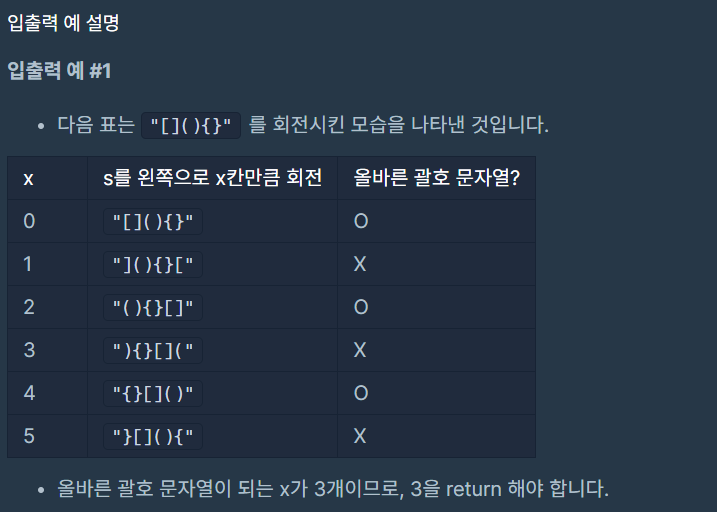
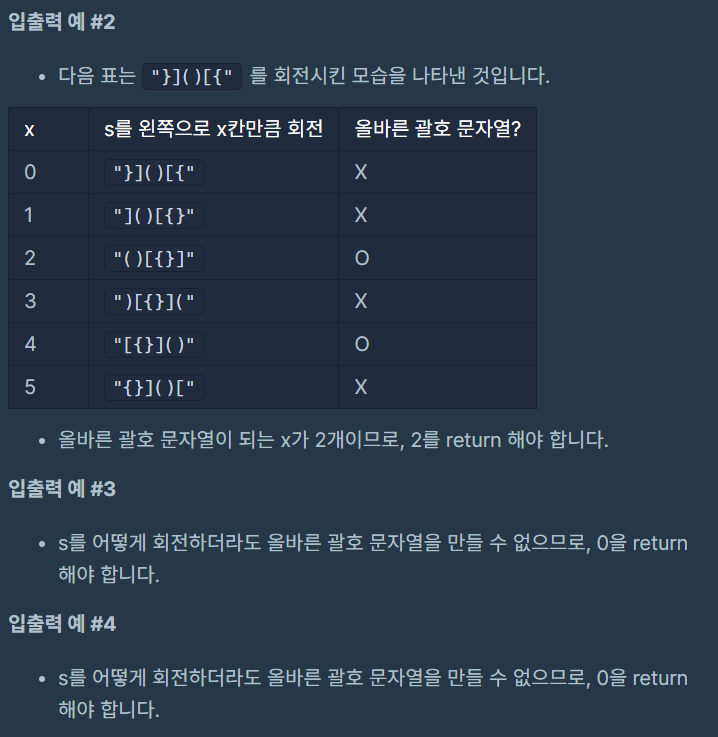

# 괄호 회전하기

### Level: 2

 

## 문제 설명

다음 규칙을 지키는 문자열을 올바른 괄호 문자열이라고 정의합니다.

- `()`, `[]`, `{}` 는 모두 올바른 괄호 문자열입니다.

- 만약 `A`가 올바른 괄호 문자열이라면, `(A)`, `[A]`, `{A}` 도 올바른 괄호 문자열입니다. 예를 들어, `[]` 가 올바른 괄호 문자열이므로, `([])` 도 올바른 괄호 문자열입니다.

- 만약 `A`, `B`가 올바른 괄호 문자열이라면, `AB` 도 올바른 괄호 문자열입니다. 예를 들어, `{}` 와 `([])` 가 올바른 괄호 문자열이므로, `{}([])` 도 올바른 괄호 문자열입니다.

대괄호, 중괄호, 그리고 소괄호로 이루어진 문자열 `s`가 매개변수로 주어집니다. 이 `s`를 왼쪽으로 x (0 ≤ x < (`s`의 길이)) 칸만큼 회전시켰을 때 `s`가 올바른 괄호 문자열이 되게 하는 x의 개수를 return 하도록 solution 함수를 완성해주세요.

 

## 제한사항

- s의 길이는 1 이상 1,000 이하입니다.

 

## 입출력

---

**Ref**: https://school.programmers.co.kr/learn/courses/30/lessons/76502