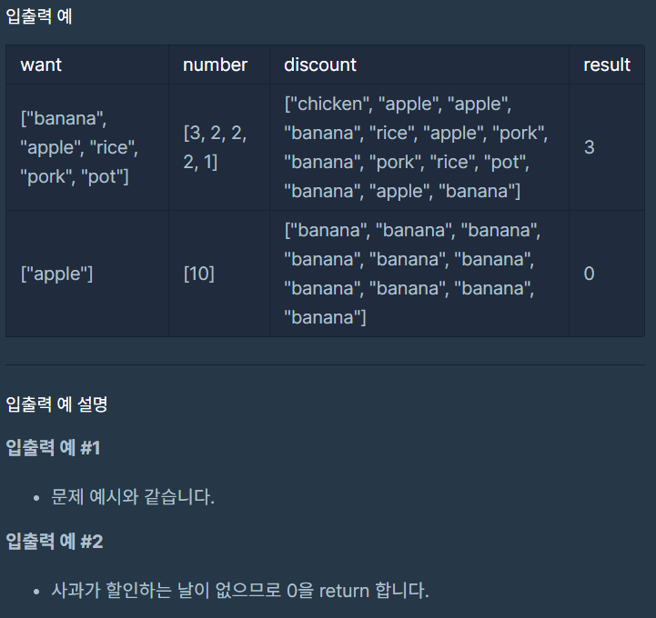

# 할인 행사

### Level: 2

 

## 문제 설명

XYZ 마트는 일정한 금액을 지불하면 10일 동안 회원 자격을 부여합니다. XYZ 마트에서는 회원을 대상으로 매일 한 가지 제품을 할인하는 행사를 합니다. 할인하는 제품은 하루에 하나씩만 구매할 수 있습니다. 알뜰한 정현이는 자신이 원하는 제품과 수량이 할인하는 날짜와 10일 연속으로 일치할 경우에 맞춰서 회원가입을 하려 합니다.

예를 들어, 정현이가 원하는 제품이 바나나 3개, 사과 2개, 쌀 2개, 돼지고기 2개, 냄비 1개이며, XYZ 마트에서 15일간 회원을 대상으로 할인하는 제품이 날짜 순서대로 치킨, 사과, 사과, 바나나, 쌀, 사과, 돼지고기, 바나나, 돼지고기, 쌀, 냄비, 바나나, 사과, 바나나인 경우에 대해 알아봅시다. 첫째 날부터 열흘 간에는 냄비가 할인하지 않기 때문에 첫째 날에는 회원가입을 하지 않습니다. 둘째 날부터 열흘 간에는 바나나를 원하는 만큼 할인구매할 수 없기 때문에 둘째 날에도 회원가입을 하지 않습니다. 셋째 날, 넷째 날, 다섯째 날부터 각각 열흘은 원하는 제품과 수량이 일치하기 때문에 셋 중 하루에 회원가입을 하려 합니다.

정현이가 원하는 제품을 나타내는 문자열 배열 `want`와 정현이가 원하는 제품의 수량을 나타내는 정수 배열 `number`, XYZ 마트에서 할인하는 제품을 나타내는 문자열 배열 `discount`가 주어졌을 때, 회원등록시 정현이가 원하는 제품을 모두 할인 받을 수 있는 회원등록 날짜의 총 일수를 return 하는 solution 함수를 완성하시오. 가능한 날이 없으면 0을 return 합니다.

 

## 제한사항

- 1 ≤ `want`의 길이 = `number`의 길이 ≤ 10
  - 1 ≤ `number`의 원소 ≤ 10
  - `number[i]`는 `want[i]`의 수량을 의미하며, `number`의 원소의 합은 10입니다.

- 10 ≤ `discount`의 길이 ≤ 100,000

- `want`와 `discount`의 원소들은 알파벳 소문자로 이루어진 문자열입니다.
  - 1 ≤ `want`의 원소의 길이, `discount`의 원소의 길이 ≤ 12

 

## 입출력

---

**Ref**: https://school.programmers.co.kr/learn/courses/30/lessons/131127