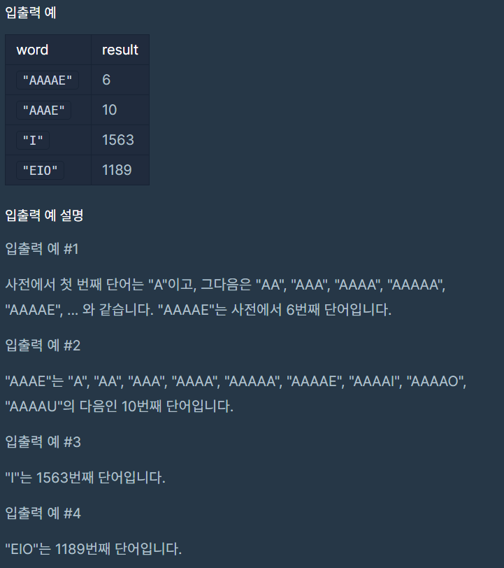

# 모음사전

### Level: 2

 

## 문제 설명

사전에 알파벳 모음 'A', 'E', 'I', 'O', 'U'만을 사용하여 만들 수 있는, 길이 5 이하의 모든 단어가 수록되어 있습니다. 사전에서 첫 번째 단어는 "A"이고, 그다음은 "AA"이며, 마지막 단어는 "UUUUU"입니다.

단어 하나 word가 매개변수로 주어질 때, 이 단어가 사전에서 몇 번째 단어인지 return 하도록 solution 함수를 완성해주세요.

 

## 제한사항

- word의 길이는 1 이상 5 이하입니다.

- word는 알파벳 대문자 'A', 'E', 'I', 'O', 'U'로만 이루어져 있습니다.

 

## 입출력

---

**Ref**: https://school.programmers.co.kr/learn/courses/30/lessons/84512