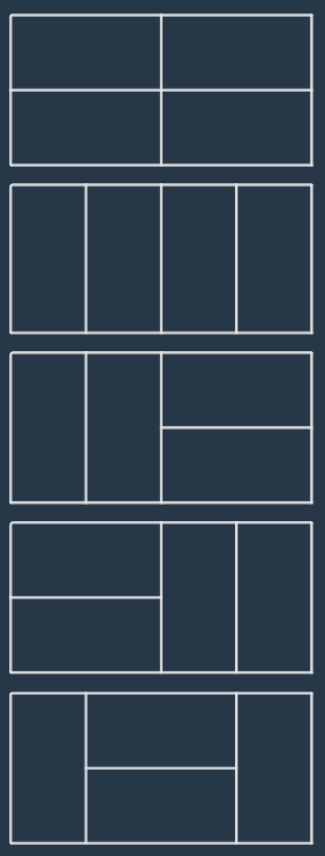

# 2 x n 타일링

### Level: 2

 

## 문제 설명

가로 길이가 2이고 세로의 길이가 1인 직사각형모양의 타일이 있습니다. 이 직사각형 타일을 이용하여 세로의 길이가 2이고 가로의 길이가 n인 바닥을 가득 채우려고 합니다. 타일을 채울 때는 다음과 같이 2가지 방법이 있습니다.

- 타일을 가로로 배치 하는 경우

- 타일을 세로로 배치 하는 경우

예를들어서 n이 7인 직사각형은 다음과 같이 채울 수 있습니다.

직사각형의 가로의 길이 n이 매개변수로 주어질 때, 이 직사각형을 채우는 방법의 수를 return 하는 solution 함수를 완성해주세요.

 

## 제한사항

- 가로의 길이 n은 60,000이하의 자연수 입니다.

- 경우의 수가 많아 질 수 있으므로, 경우의 수를 1,000,000,007으로 나눈 나머지를 return해주세요.

 

## 입출력

---

**Ref**: https://school.programmers.co.kr/learn/courses/30/lessons/12900