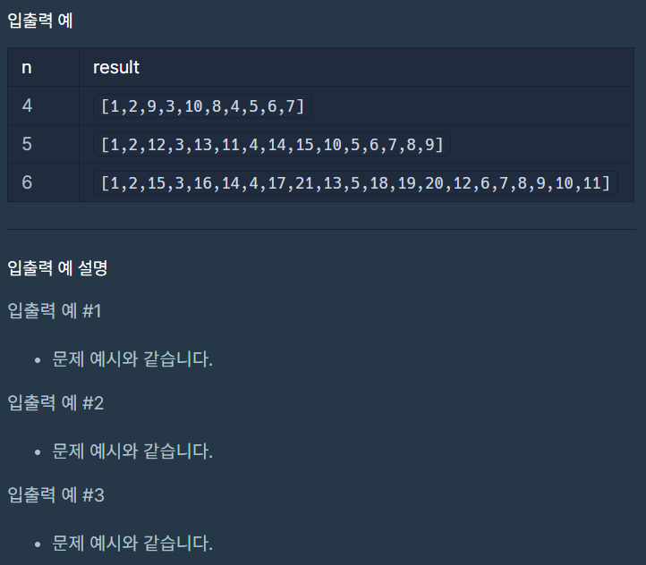

# 삼각 달팽이

### Level: 2

 

## 문제 설명

정수 n이 매개변수로 주어집니다. 다음 그림과 같이 밑변의 길이와 높이가 n인 삼각형에서 맨 위 꼭짓점부터 반시계 방향으로 달팽이 채우기를 진행한 후, 첫 행부터 마지막 행까지 모두 순서대로 합친 새로운 배열을 return 하도록 solution 함수를 완성해주세요.

 

## 제한사항

- n은 1 이상 1,000 이하입니다.

 

## 입출력

---

**Ref**: https://school.programmers.co.kr/learn/courses/30/lessons/68645