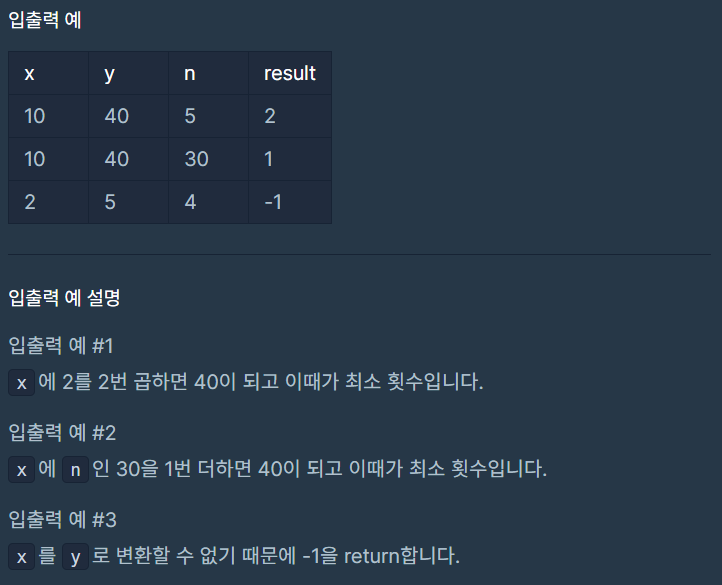

# 숫자 변환하기

### Level: 2

 

## 문제 설명

자연수 `x`를 `y`로 변환하려고 합니다. 사용할 수 있는 연산은 다음과 같습니다.

- `x`에 `n`을 더합니다

- `x`에 2를 곱합니다.

- `x`에 3을 곱합니다.

자연수 `x`, `y`, `n`이 매개변수로 주어질 때, `x`를 `y`로 변환하기 위해 필요한 최소 연산 횟수를 return하도록 solution 함수를 완성해주세요. 이때 `x`를 `y`로 만들 수 없다면 -1을 return 해주세요.

 

## 제한사항

- 1 ≤ `x` ≤ `y` ≤ 1,000,000

- 1 ≤ `n` < `y`

 

## 입출력

---

**Ref**: https://school.programmers.co.kr/learn/courses/30/lessons/154538