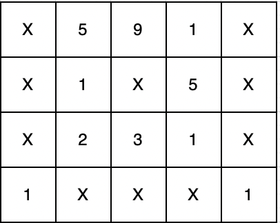
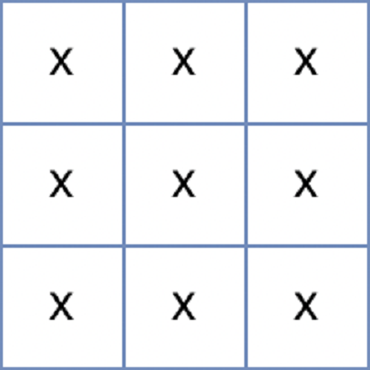

# 무인도 여행

### Level: 2

 

## 문제 설명

메리는 여름을 맞아 무인도로 여행을 가기 위해 지도를 보고 있습니다. 지도에는 바다와 무인도들에 대한 정보가 표시돼 있습니다. 지도는 1 x 1크기의 사각형들로 이루어진 직사각형 격자 형태이며, 격자의 각 칸에는 'X' 또는 1에서 9 사이의 자연수가 적혀있습니다. 지도의 'X'는 바다를 나타내며, 숫자는 무인도를 나타냅니다. 이때, 상, 하, 좌, 우로 연결되는 땅들은 하나의 무인도를 이룹니다. 지도의 각 칸에 적힌 숫자는 식량을 나타내는데, 상, 하, 좌, 우로 연결되는 칸에 적힌 숫자를 모두 합한 값은 해당 무인도에서 최대 며칠동안 머물 수 있는지를 나타냅니다. 어떤 섬으로 놀러 갈지 못 정한 메리는 우선 각 섬에서 최대 며칠씩 머물 수 있는지 알아본 후 놀러갈 섬을 결정하려 합니다.

지도를 나타내는 문자열 배열 `maps`가 매개변수로 주어질 때, 각 섬에서 최대 며칠씩 머무를 수 있는지 배열에 오름차순으로 담아 return 하는 solution 함수를 완성해주세요. 만약 지낼 수 있는 무인도가 없다면 -1을 배열에 담아 return 해주세요.

 

## 제한사항

- 3 ≤ `maps`의 길이 ≤ 100
  - 3 ≤ `maps[i]`의 길이 ≤ 100
  - `maps[i]`는 'X' 또는 1 과 9 사이의 자연수로 이루어진 문자열입니다.
  - 지도는 직사각형 형태입니다.

 

## 입출력

**입출력 예 #1**

위 문자열은 다음과 같은 지도를 나타냅니다.

연결된 땅들의 값을 합치면 다음과 같으며

이를 오름차순으로 정렬하면 [1, 1, 27]이 됩니다.

**입출력 예 #2**

위 문자열은 다음과 같은 지도를 나타냅니다.

섬이 존재하지 않기 때문에 -1을 배열에 담아 반환합니다.

---

**Ref**: https://school.programmers.co.kr/learn/courses/30/lessons/154540