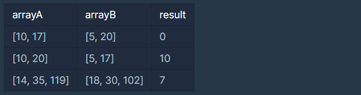

# 숫자 카드 나누기

### Level: 2

 

## 문제 설명

철수와 영희는 선생님으로부터 숫자가 하나씩 적힌 카드들을 절반씩 나눠서 가진 후, 다음 두 조건 중 하나를 만족하는 <U>가장 큰 양의 정수 a</U>의 값을 구하려고 합니다.

1. 철수가 가진 카드들에 적힌 모든 숫자를 나눌 수 있고 영희가 가진 카드들에 적힌 모든 숫자들 중 하나도 나눌 수 없는 양의 정수 a

2. 영희가 가진 카드들에 적힌 모든 숫자를 나눌 수 있고, 철수가 가진 카드들에 적힌 모든 숫자들 중 하나도 나눌 수 없는 양의 정수 a

예를 들어, 카드들에 10, 5, 20, 17이 적혀 있는 경우에 대해 생각해 봅시다. 만약, 철수가 [10, 17]이 적힌 카드를 갖고, 영희가 [5, 20]이 적힌 카드를 갖는다면 두 조건 중 하나를 만족하는 양의 정수 a는 존재하지 않습니다. 하지만, 철수가 [10, 20]이 적힌 카드를 갖고, 영희가 [5, 17]이 적힌 카드를 갖는다면, 철수가 가진 카드들의 숫자는 모두 10으로 나눌 수 있고, 영희가 가진 카드들의 숫자는 모두 10으로 나눌 수 없습니다. 따라서 철수와 영희는 각각 [10, 20]이 적힌 카드, [5, 17]이 적힌 카드로 나눠 가졌다면 조건에 해당하는 양의 정수 a는 10이 됩니다.

철수가 가진 카드에 적힌 숫자들을 나타내는 정수 배열 `arrayA`와 영희가 가진 카드에 적힌 숫자들을 나타내는 정수 배열 `arrayB`가 주어졌을 때, 주어진 조건을 만족하는 가장 큰 양의 정수 a를 return하도록 solution 함수를 완성해 주세요. 만약, 조건을 만족하는 a가 없다면, 0을 return 해 주세요.

 

## 제한사항

- 1 ≤ `arrayA`의 길이 = `arrayB`의 길이 ≤ 500,000

- 1 ≤ `arrayA`의 원소, `arrayB`의 원소 ≤ 100,000,000

- `arrayA`와 `arrayB`에는 중복된 원소가 있을 수 있습니다.

 

## 입출력

**입출력 예 #1**

- 문제 예시와 같습니다.

**입출력 예 #2**

- 문제 예시와 같습니다.

**입출력 예 #3**

- 철수가 가진 카드에 적힌 숫자들은 모두 3으로 나눌 수 없고, 영희가 가진 카드에 적힌 숫자는 모두 3으로 나눌 수 있습니다. 따라서 3은 조건에 해당하는 양의 정수입니다. 하지만, 철수가 가진 카드들에 적힌 숫자들은 모두 7로 나눌 수 있고, 영희가 가진 카드들에 적힌 숫자는 모두 7로 나눌 수 없습니다. 따라서 최대값인 7을 return 합니다.

---

**Ref**: https://school.programmers.co.kr/learn/courses/30/lessons/135807