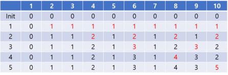

# 숫자 블록

### Level: 2

 

## 문제 설명

그렙시에는 숫자 0이 적힌 블록들이 설치된 도로에 다른 숫자가 적힌 블록들을 설치하기로 하였습니다. 숫자 블록을 설치하는 규칙은 다음과 같습니다.

블록에 적힌 번호가 n 일 때, 가장 첫 블록은 n * 2번째 위치에 설치합니다. 그 다음은 n * 3, 그 다음은 n * 4, ...위치에 설치합니다. 기존에 설치된 블록은 빼고 새로운 블록을 집어넣습니다.

블록은 1이 적힌 블록부터 숫자를 1씩 증가시키며 순서대로 설치합니다. 예를 들어 1이 적힌 블록은 2, 3, 4, 5, ... 인 위치에 우선 설치합니다. 그 다음 2가 적힌 블록은 4, 6, 8, 10, ... 인 위치에 설치하고, 3이 적힌 블록은 6, 9, 12... 인 위치에 설치합니다.

이렇게 3이 적힌 블록까지 설치하고 나면 첫 10개의 블록에 적힌 번호는 [0, 1, 1, 2, 1, 3, 1, 2, 3, 2]가 됩니다.

그렙시는 길이가 1,000,000,000인 도로에 1부터 10,000,000까지의 숫자가 적힌 블록들을 이용해 위의 규칙대로 모두 설치 했습니다.

그렙시의 시장님은 특정 구간에 어떤 블록이 깔려 있는지 알고 싶습니다.

구간을 나타내는 두 정수 `begin`, `end` 가 매개변수로 주어 질 때, 그 구간에 깔려 있는 블록의 숫자 배열을 return하는 solution 함수를 완성해 주세요.

 

## 제한사항

- 1 ≤ `begin` ≤ `end` ≤ 1,000,000,000

- `end` - `begin` ≤ 5,000

 

## 입출력

| begin | end | result                         |
| ----- | --- | ------------------------------ |
| 1     | 10  | [0, 1, 1, 2, 1, 3, 1, 4, 3, 5] |

**입출력 예 #1**

다음과 같이 블럭이 깔리게 됩니다.

---

**Ref**: https://school.programmers.co.kr/learn/courses/30/lessons/12923